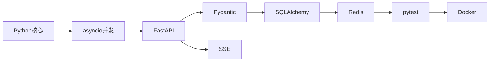

# 🚀 第一周学习首页

> 目标：从“能写 Python 脚本”提升到“能独立实现、测试和部署一个小型 API 服务”。

## 本周主线

## 导航
- [[01-第一周知识地图]]
- [[02-五天学习路线]]
- [[03-学习进度Checklist]]
- [[04-第一周核心数据流]]
- [[05-如何使用这个知识库]]
- [[06-本版新增-简单例子与返回结果]]
- [[../01-Python核心/00-Python核心-MOC|Python核心]]
- [[../02-Asyncio与并发/00-Asyncio-MOC|Asyncio与并发]]
- [[../03-FastAPI/00-FastAPI-MOC|FastAPI]]
- [[../04-Pydantic/00-Pydantic-MOC|Pydantic]]
- [[../05-数据库与SQLAlchemy/00-数据库-MOC|数据库与SQLAlchemy]]
- [[../06-Redis与缓存/00-Redis-MOC|Redis与缓存]]
- [[../07-认证与权限/00-认证权限-MOC|认证与权限]]
- [[../08-流式通信/00-流式通信-MOC|SSE与WebSocket]]
- [[../09-测试与工程/00-测试工程-MOC|测试与工程]]
- [[../10-综合项目-ai-service-starter/00-项目说明|综合项目]]
- [[../11-面试题/00-第一周40题总览|第一周40题]]
- [[../12-练习/综合Debug练习|综合Debug]]

## 使用方法
1. 按 Day 1 → Day 5 学。
2. 每篇先看“一句话理解”，再遮住“运行 / 返回结果”自己预测一次，然后跑代码验证。
3. 遇到 `[[双向链接]]` 顺着跳，建立知识链。
4. 面试题先口述 30~60 秒，再看回答骨架。
5. 最后回到综合项目，把知识串起来。
