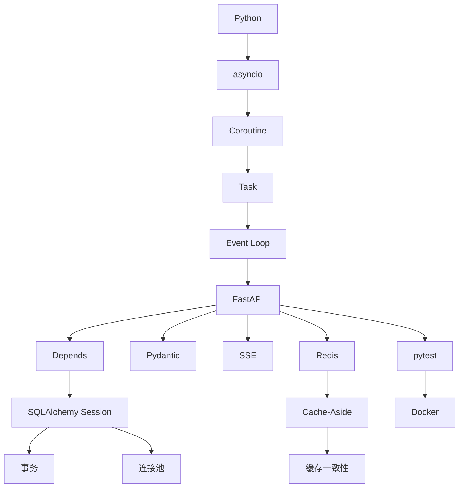

# 第一周知识地图

## 关键知识链
- [[../01-Python核心/09-上下文管理器]] → [[../05-数据库与SQLAlchemy/10-事务]] → [[../05-数据库与SQLAlchemy/12-Session生命周期]]
- [[../02-Asyncio与并发/04-async与await]] → [[../02-Asyncio与并发/08-Event-Loop事件循环]] → [[../03-FastAPI/18-def还是async-def]]
- [[../03-FastAPI/05-依赖注入]] → [[../05-数据库与SQLAlchemy/12-Session生命周期]] → [[../09-测试与工程/07-dependency-overrides]]
- [[../06-Redis与缓存/02-Cache-Aside]] → [[../06-Redis与缓存/03-缓存一致性]] → [[../06-Redis与缓存/18-延迟双删与消息同步]]
- [[../08-流式通信/02-SSE]] → [[../08-流式通信/07-SSE-vs-WebSocket]] → [[../08-流式通信/08-LLM流式输出]]
