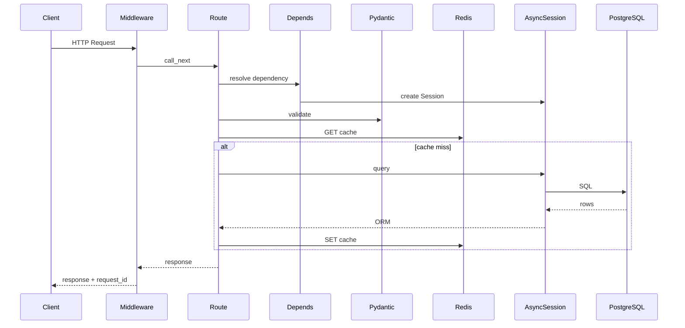

# 第一周核心数据流

```mermaid
sequenceDiagram
participant C as Client
participant M as Middleware
participant R as Route
participant D as Depends
participant P as Pydantic
participant RC as Redis
participant S as AsyncSession
participant DB as PostgreSQL
C->>M: HTTP Request
M->>R: call_next
R->>D: resolve dependency
D->>S: create Session
R->>P: validate
R->>RC: GET cache
alt cache miss
R->>S: query
S->>DB: SQL
DB-->>S: rows
S-->>R: ORM
R->>RC: SET cache
end
R-->>M: response
M-->>C: response + request_id
```
