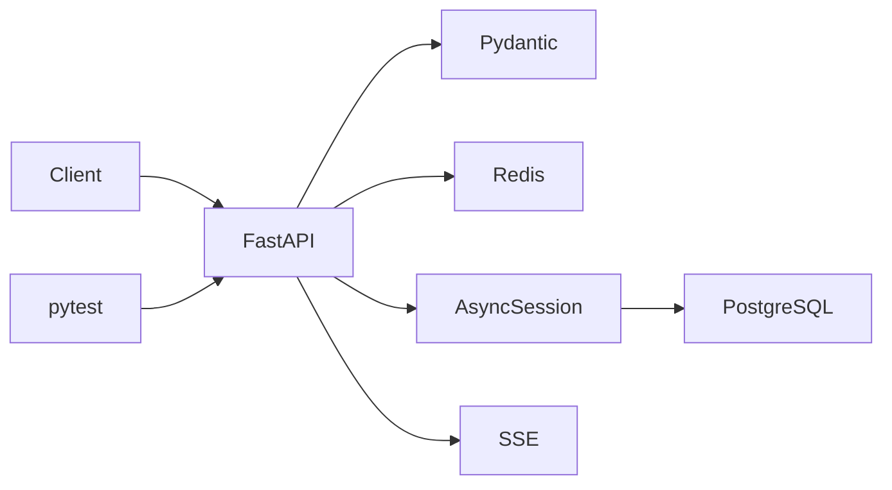

# 项目架构

```mermaid
flowchart LR
Client --> FastAPI
FastAPI --> Pydantic
FastAPI --> Redis
FastAPI --> AsyncSession
AsyncSession --> PostgreSQL
FastAPI --> SSE
pytest --> FastAPI
```

关联：[[../03-FastAPI/00-FastAPI-MOC]]、[[../05-数据库与SQLAlchemy/12-Session生命周期]]、[[../06-Redis与缓存/02-Cache-Aside]]。
