# 一、深度学习概述


## 1. 什么是深度学习

​	人工智能、机器学习和深度学习之间的关系：


​	机器学习是实现人工智能的一种途径，深度学习是机器学习的子集，区别如下：

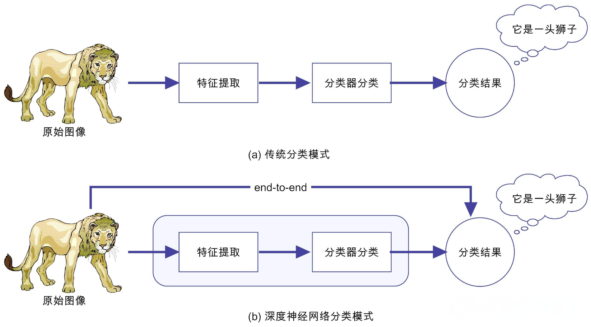


​	传统机器学习算法依赖人工设计特征、提取特征，而深度学习依赖算法自动提取特征。深度学习模仿人类大脑的运行方式，从大量数据中学习特征，这也是深度学习被看做黑盒子、可解释性差的原因。

​	随着算力的提升，深度学习可以处理图像，文本，音频，视频等各种内容，主要应用领域有：

1. 图像处理：分类、目标检测、图像分割（语义分割）
2. 自然语言处理：LLM、NLP、Transformer
3. 语音识别：对话机器人、智能客服（语音+NLP）
4. 自动驾驶：语义分割（行人、车辆、实线等）
5. LLM：大Large语言Language模型Model
6. 机器人：非常火的行业

有了大模型的加持，AI+各行各业。


## 2. 深度学习发展历史


​	   深度学习其实并不是新的事物，深度学习所需要的神经网络技术起源于20世纪50年代，叫做感知机。当时使用单层感知机，因为只能学习线性可分函数，连简单的异或(XOR)等线性不可分问题都无能为力，1969年Marvin Minsky写了一本叫做《Perceptrons》的书，他提出了著名的两个观点：1.单层感知机没用，我们需要多层感知机来解决复杂问题 2.没有有效的训练算法。

​	   20世纪80年代末期，用于人工神经网络的反向传播算法（也叫Back Propagation算法或者BP算法）的发明，给机器学习带来了希望，掀起了基于统计模型的机器学习热潮。这个热潮一直持续到今天。人们发现，利用BP算法可以让一个人工神经网络模型从大量训练样本中学习统计规律，从而对未知事件做预测。这种基于统计的机器学习方法比起过去基于人工规则的系统，在很多方面显出优越性。这个时候的人工神经网络，虽也被称作多层感知机（Multi-layer Perceptron），但实际是种只含有一层隐层节点的浅层模型。

​		2006年，杰弗里·辛顿以及他的学生鲁斯兰·萨拉赫丁诺夫正式提出了深度学习的概念。

​		2012年，在著名的ImageNet图像识别大赛中，杰弗里·辛顿领导的小组采用深度学习模型AlexNet一举夺冠。AlexNet采用ReLU激活函数，从根本上解决了梯度消失问题，并采用GPU极大的提高了模型的运算速度。

​		同年，吴恩达教授和Jeff Dean主导的深度神经网络DNN技术在ImageNet评测中把错误率从26％降低到15％，再一次吸引了学术界和工业界对于深度学习领域的关注。

​	2016年，随着谷歌公司基于深度学习开发的AlphaGo以4:1的比分战胜了国际顶尖围棋高手李世石，深度学习的热度一时无两。后来，AlphaGo又接连和众多世界级围棋高手过招，均取得了完胜。这也证明了在围棋界，基于深度学习技术的机器人已经超越了人类。

​	2017年，基于强化学习算法的AlphaGo升级版AlphaGo Zero横空出世。其采用“从零开始”、“无师自通”的学习模式，以100:0的比分轻而易举打败了之前的AlphaGo。除了围棋，它还精通国际象棋等其它棋类游戏，可以说是真正的棋类“天才”。此外在这一年，深度学习的相关算法在医疗、金融、艺术、无人驾驶等多个领域均取得了显著的成果。所以，也有专家把2017年看作是深度学习甚至是人工智能发展最为突飞猛进的一年。

​	2019年，基于Transformer 的自然语言模型的持续增长和扩散，这是一种语言建模神经网络模型，可以在几乎所有任务上提高NLP的质量。Google甚至将其用作相关性的主要信号之一，这是多年来最重要的更新。

​	2020年，深度学习扩展到更多的应用场景，比如积水识别，路面塌陷等，而且疫情期间，在智能外呼系统，人群测温系统，口罩人脸识别等都有深度学习的应用。


## 3. 深度学习的优势


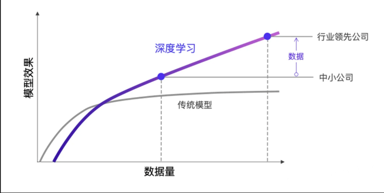


# 二、神经网络

​		我们要学习的**深度学习**(Deep Learning)是神经网络的一个子领域，主要关注更深层次的神经网络结构，也就是**深层神经网络**（Deep Neural Networks，DNNs）。所以，我们需要先搞清楚什么是神经网络！

## 1. 感知神经网络

神经网络（Neural Networks）是一种模拟人脑神经元网络结构的计算模型，用于处理复杂的模式识别、分类和预测等任务。生物神经元如下图：

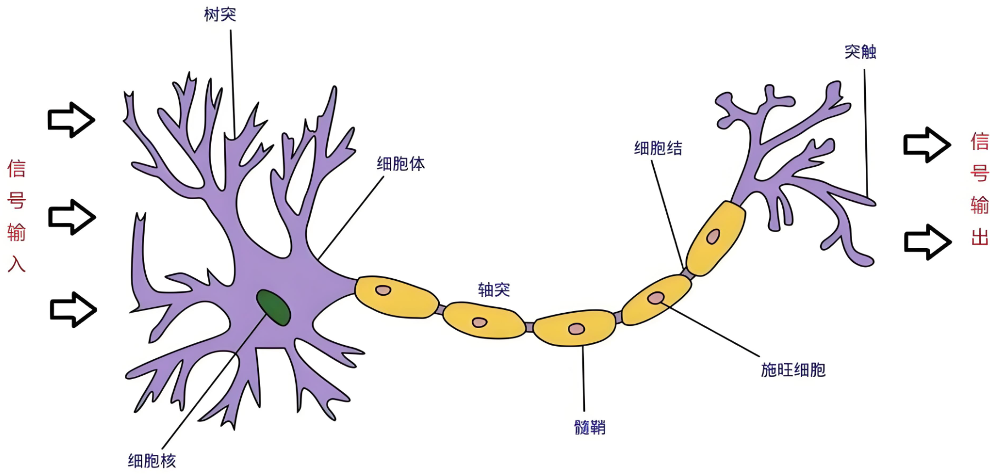


**生物学：**

人脑可以看做是一个生物神经网络，由众多的神经元连接而成

- 树突：从其他神经元接收信息的分支
- 细胞核：处理从树突接收到的信息
- 轴突：被神经元用来传递信息的生物电缆
- 突触：轴突和其他神经元树突之间的连接

人脑神经元处理信息的过程：

- 多个信号到达树突，然后整合到细胞体的细胞核中
- 当积累的信号超过某个阈值，细胞就会被激活
- 产生一个输出信号，由轴突传递。

神经网络由多个互相连接的节点（即人工神经元）组成。

## **2. 人工神经元**

​		人工神经元(Artificial Neuron)是神经网络的基本构建单元，模仿了生物神经元的工作原理。其核心功能是接收输入信号，经过加权求和和非线性激活函数处理后，输出结果。

### 2.1 构建人工神经元

人工神经元接受多个输入信息，对它们进行加权求和，再经过激活函数处理，最后将这个结果输出。

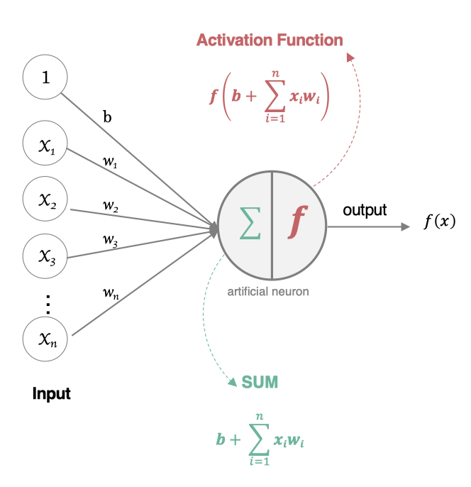

### 2.2 组成部分

- 输入（Inputs）: 代表输入数据，通常用向量表示，每个输入值对应一个权重。
- 权重（Weights）: 每个输入数据都有一个权重，表示该输入对最终结果的重要性。
- 偏置（Bias）: 一个额外的可调参数，作用类似于线性方程中的截距，帮助调整模型的输出。
- 加权求和: 神经元将输入乘以对应的权重后求和，再加上偏置。
- 激活函数（Activation Function）: 用于将加权求和后的结果转换为输出结果，引入非线性特性，使神经网络能够处理复杂的任务。常见的激活函数有Sigmoid、ReLU（Rectified Linear Unit）、Tanh等。

### 2.3 数学表示

如果有 n 个输入 $$x_1, x_2, \ldots, x_n$$，权重分别为 $$w_1, w_2, \ldots, w_n$$，偏置为 $$b$$，则神经元的输出 $$y$$ 表示为：
$$
z=\sum_{i=1}^nw_i\cdot x_i+b \\
y=\sigma(z)
$$
其中，$$\sigma(z)$$ 是激活函数。

例如：

线性回归：
$$
y=\sum_{i=1}^nw_i\cdot x_i+b \\
$$
线性回归不需要激活函数

逻辑回归：
$$
z=\sum_{i=1}^nw_i\cdot x_i+b \\
y=\sigma(z)=sigmoid(z)=\frac{1}{1+e^{-z}}
$$

### 2.4 对比生物神经元

人工神经元和生物神经元对比如下表：

| 生物神经元 | 人工神经元                 |
| ---------- | -------------------------- |
| 细胞核     | 节点 (加权求和 + 激活函数) |
| 树突       | 输入                       |
| 轴突       | 带权重的连接               |
| 突触       | 输出                       |

## 3. 深入神经网络

神经网络是由大量人工神经元按层次结构连接而成的计算模型。每一层神经元的输出作为下一层的输入，最终得到网络的输出。

### 3.1 基本结构

神经网络有下面三个基础层（Layer）构建而成：

- **输入层（Input）**: 神经网络的第一层，负责接收外部数据，不进行计算。

- **隐藏层（Hidden）**: 位于输入层和输出层之间，进行特征提取和转换。隐藏层一般有多层，每一层有多个神经元。

- **输出层（Output）**: 网络的最后一层，产生最终的预测结果或分类结果

### 3.2 网络构建

我们使用多个神经元来构建神经网络，相邻层之间的神经元相互连接，并给每一个连接分配一个权重，经典如下：

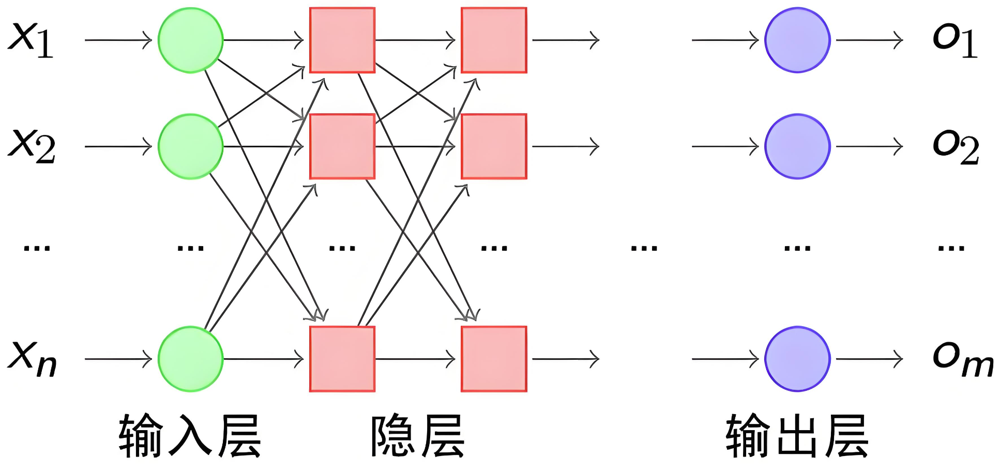

注意：同一层的各个神经元之间是没有连接的。

### 3.3 全连接神经网络

前馈神经网络（Feedforward Neural Network，FNN）是一种最基本的神经网络结构，其特点是信息从输入层经过隐藏层单向传递到输出层，**没有反馈或循环连接**。

全连接神经网络（Fully Connected Neural Network，FCNN）是前馈神经网络的一种，每一层的神经元与上一层的所有神经元全连接，常用于图像分类、文本分类等任务。

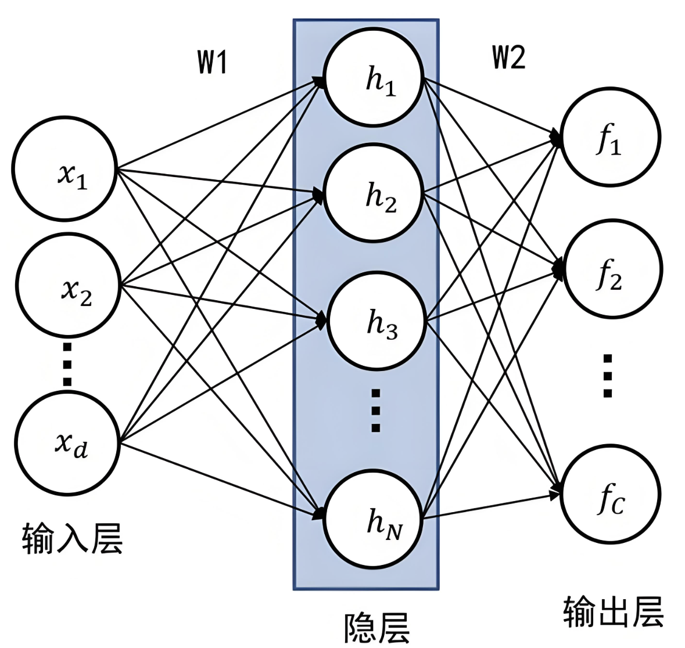

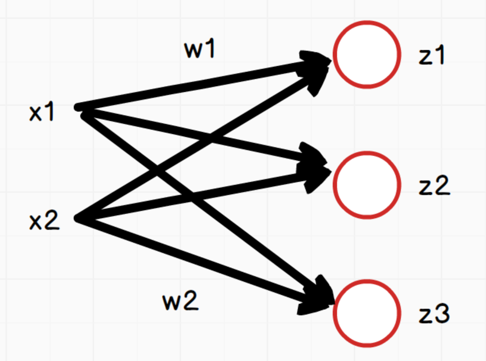

如上图，网络中每个神经元：
$$
z_1 = x_1*w_1 + x_2*w_2+b_1 \\
z_2 = x_1*w_1 + x_2*w_2+b_2 \\
z_3 = x_1*w_1 + x_2*w_2+b_3
$$
说明：三个等式中的w1和w2在这里只是为了方便表示对应x1和x2的权重，实际三个等式中的w值是不同的。

向量x为：$[x_1,x_2]$

向量w：$$\begin{pmatrix}w_1,w_2\\w_1,w_2\\w_1,w_2 \end{pmatrix}$$，其形状为（3，2），3是神经元节点个数，2是向量x的个数

向量z：$$[z_1,z_2,z_3]$$

向量b：$[b_1,b_2,b_3]$

所以用向量表示为：
$$
z = \begin{pmatrix}z_1,z_2,z_3 \end{pmatrix}=\begin{pmatrix}x_1,x_2 \end{pmatrix}\begin{pmatrix}w_1,w_1,w_1\\w_2,w_2,w_2\end{pmatrix}+\begin{pmatrix}b_1,b_2,b_3 \end{pmatrix}=\begin{pmatrix}x_1,x_2 \end{pmatrix}\begin{pmatrix}w_1,w_2\\w_1,w_2\\w_1,w_2 \end{pmatrix}^T + \begin{pmatrix}b_1,b_2,b_3 \end{pmatrix}=xw^T+b
$$

- x是输入数据，形状为 (batch_size, in_features)。
- W是权重矩阵，形状为 (out_features, in_features)。
- b是偏置项，形状为 (out_features,)。
- z是输出数据，形状为 (batch_size, out_features)。

#### 3.3.1 特点

- 全连接层: 层与层之间的每个神经元都与前一层的所有神经元相连。
- 权重数量: 由于全连接的特点，权重数量较大，容易导致计算量大、模型复杂度高。
- 学习能力: 能够学习输入数据的全局特征，但对于高维数据却不擅长捕捉局部特征（如图像就需要CNN）。

#### 3.3.2 计算步骤

1. 数据传递: 输入数据经过每一层的计算，逐层传递到输出层。
2. 激活函数: 每一层的输出通过激活函数处理。
3. 损失计算: 在输出层计算预测值与真实值之间的差距，即损失函数值。
4. 反向传播（Back Propagation）: 通过反向传播算法计算损失函数对每个权重的梯度，并更新权重以最小化损失。

#### 3.3.3 基本组件认知

先初步认知，他们用法基本一样的，后续在学习深度神经网络和卷积神经网络的过程中会**很自然**的学到更多组件！

官方文档：https://pytorch.org/docs/stable/nn.html

**线性层组件**

nn.Linear是 PyTorch 中的一个非常重要的模块，用于实现全连接层（也称为线性层）。它是神经网络中常用的一种层类型，主要用于将输入数据通过线性变换映射到输出空间。

```
torch.nn.Linear(in_features, out_features, bias=True)
```

参数说明：

in_features：

- 输入特征的数量（即输入数据的维度）。
- 例如，如果输入是一个长度为 100 的向量，则 in_features=100。

out_features：

- 输出特征的数量（即输出数据的维度）。
- 例如，如果希望输出是一个长度为 50 的向量，则 out_features=50。

bias：

- 是否使用偏置项（默认值为 True）。
- 如果设置为 False，则不会学习偏置项。

示例：构建3层全连接神经网络：在`__init__`方法中定义网络结构，在forward定义前向传播

```python

import torch
from torch import nn
# 定义全连接神经网络模型
class MyFcnn(nn.Module):
    def __init__(self, input_size,out_size):
        # 父类初始化
        super(MyFcnn, self).__init__()
        # 定义线性层1
        self.fc1 = nn.Linear(input_size, 64)

        # 定义线性层2，输入要和第一层的输出一致
        self.fc2 = nn.Linear(64, 32)

        # 定义线性层3，输入要和第二层的输出一致
        self.fc3 = nn.Linear(32, out_size)

    def forward(self, x):
        x = self.fc1(x)
        x = self.fc2(x)
        x = self.fc3(x)
        return x

input_size = 32
out_size = 1
model = MyFcnn(input_size,out_size)
print(model)
```

如果模型中线性层按顺序叠加，也可以使用nn.Sequential构建模型。`nn.Sequential` 是一个**顺序容器**，内置了自动的前向传播逻辑，它会自动将输入数据依次传递给其中的每一层，并执行前向传播，不需要显式定义 `forward()` 方法。

```python
import torch
from torch import nn

input_size = 32
# 定义全连接神经网络模型
model = nn.Sequential(
    nn.Linear(input_size, 64),
    nn.Linear(64, 32),
    nn.Linear(32, 1)
)
print(model)
```

**激活函数组件**

激活函数的作用是在隐藏层引入非线性，使得神经网络能够学习和表示复杂的函数关系，使网络具备**非线性能力**，增强其表达能力。

常见激活函数：

sigmoid函数：

```python
import torch.nn.functional as F
sigmoid = F.sigmoid()
```

tanh函数：

```python
tanh = F.tanh()
```

ReLU函数：

```python
import torch.nn as nn
relu = nn.ReLU()
```

LeakyReLU函数：

```python
leaky_relu = nn.LeakyReLU(negative_slope=0.01)
```

softmax函数：

```python
softmax = F.softmax
```

**损失函数组件**

损失函数的主要作用是量化模型预测值（*y*^）与真实值（*y*）之间的差异。通常，损失函数的值越小，表示模型的预测越接近真实值。训练过程中，通过优化算法（如梯度下降）最小化损失函数，从而调整模型的参数。

PyTorch已内置多种损失函数，在构建神经网络时随用随取！

文档：https://pytorch.org/docs/stable/nn.html#loss-functions

根据任务类型（如回归、分类等），损失函数可以分为以下几类：

**回归任务的损失函数**：

1.均方误差损失（MSE Loss）

- 函数: torch.nn.MSELoss

  ```python
  import torch.nn as nn
  loss_fn = nn.MSELoss()
  ```

 2.L1 损失（L1 Loss）

也叫做MAE（Mean Absolute Error，平均绝对误差）

- 函数: torch.nn.L1Loss

  ```python
  import torch.nn as nn
  loss_fn = nn.L1Loss()
  ```

**分类任务的损失函数**：

1.交叉熵损失（Cross-Entropy Loss）

- 函数: torch.nn.CrossEntropyLoss

  ```
  cross_entropy_loss = nn.CrossEntropyLoss()
  ```

- 参数：reduction：mean-平均值，sum-总和

- 适用场景: 用于多分类任务。

2.二元交叉熵损失（Binary Cross-Entropy Loss）

- 函数: torch.nn.BCELoss 或 torch.nn.BCEWithLogitsLoss

  ```python
  bce_loss = nn.BCELoss()
  bce_with_logits_loss = nn.BCEWithLogitsLoss()
  ```

- 适用场景: 用于二分类任务。

- 特点: BCEWithLogitsLoss 更稳定，因为它结合了 Sigmoid 激活函数和 BCE 损失。

- **注意**：使用 `nn.BCELoss` 时，需要确保预测值经过 `sigmoid` 函数处理。如果预测值是 logits（即未经 `sigmoid` 处理的预测值），可以使用 `nn.BCEWithLogitsLoss`，它内部会自动应用 `sigmoid` 函数。

**优化器**

官方文档：https://pytorch.org/docs/stable/optim.html

在PyTorch中，优化器（Optimizer）是用于更新模型参数以最小化损失函数的核心工具。

PyTorch 在 `torch.optim` 模块中提供了多种优化器，常用的包括：

- **SGD**（随机梯度下降）
- **Adagrad**（自适应梯度）
- **RMSprop**（均方根传播）
- **Adam**（自适应矩估计）

核心方法有：

`zero_grad()`：清空模型参数的梯度（将梯度置零）。必须在`loss.backward()`之前调用`zero_grad()`，避免梯度累积。

`step()`：参数更新；是优化器的核心方法，用于根据计算得到的梯度更新模型参数。优化器会根据梯度和学习率等参数，调整模型的权重和偏置。

以SGD(随机梯度下降)优化器为例：

```python
import torch
import torch.nn as nn
import torch.optim as optim

# 优化方法SGD的学习
def test003():
    model = nn.Linear(20, 60)
    criterion = nn.MSELoss()
    # 优化器：更新模型参数
    optimizer = optim.SGD(model.parameters(), lr=0.01)
    input = torch.randn(128, 20)
    output = model(input)
    # 计算损失及反向传播
    loss = criterion(output, torch.randn(128, 60))
    # 梯度清零
    optimizer.zero_grad()
    # 反向传播
    loss.backward()
    # 更新模型参数
    optimizer.step()
    
    print(loss.item())


if __name__ == "__main__":
    test003()

```

- optim.SGD(）：优化器方法；是 PyTorch 提供的随机梯度下降（Stochastic Gradient Descent, SGD）优化器。
- model.parameters()：模型参数获取；是一个生成器，用于获取模型中所有可训练的参数（权重和偏置）。

注意：这里只是组件认识和用法演示，没有具体的模型训练功能实现

# 三、数据准备

## 1. 数据加载器

分数据集和加载器2个步骤~

### 1.1 构建数据类

#### 1.1.1 Dataset类

Dataset是一个抽象类，是所有自定义数据集应该继承的基类。它定义了数据集必须实现的方法。

必须实现的方法

1. `__len__`: 返回数据集的大小
2. `__getitem__`: 支持整数索引，返回对应的样本

在 PyTorch 中，构建自定义数据加载类通常需要继承 torch.utils.data.Dataset 并实现以下几个方法：

1. **\__init__ 方法**
   用于初始化数据集对象：通常在这里加载数据，或者定义如何从存储中获取数据的路径和方法。

   ```python
   def __init__(self, data, labels):
       self.data = data
       self.labels = labels
   ```

2. **\__len__ 方法**
   返回样本数量：需要实现，以便 Dataloader加载器能够知道数据集的大小。

   ```python
   def __len__(self):
       return len(self.data)
   ```

3. **\__getitem__ 方法**
   根据索引返回样本：将从数据集中提取一个样本，并可能对样本进行预处理或变换。

   ```python
   def __getitem__(self, index):
       sample = self.data[index]
       label = self.labels[index]
       return sample, label
   ```

​		如果你需要进行更多的预处理或数据变换，可以在 **\__getitem__** 方法中添加额外的逻辑。

- **整体参考代码如下**：

```python
import torch
import torch.nn as nn
from torch.utils.data import Dataset, DataLoader


# 定义数据加载类
class CustomDataset(Dataset):
    def __init__(self, data, labels):
        """
        初始化数据集
        :data: 样本数据（例如，一个 NumPy 数组或 PyTorch 张量）
        :labels: 样本标签
        """
        self.data = data
        self.labels = labels

    def __len__(self):
        return len(self.data)

    def __getitem__(self, index):
        index = min(max(index, 0), len(self.data) - 1)
        sample = self.data[index]
        label = self.labels[index]
        return sample, label


def test001():
    # 简单的数据集准备
    data_x = torch.randn(666, 20, requires_grad=True, dtype=torch.float32)
    data_y = torch.randn(data_x.shape[0], 1, dtype=torch.float32)
    dataset = CustomDataset(data_x, data_y)
    # 随便打印个数据看一下
    print(dataset[0])


if __name__ == "__main__":
    test001()

```

#### 1.1.2 TensorDataset类

`TensorDataset`是`Dataset`的一个简单实现，它封装了张量数据，适用于数据已经是张量形式的情况。

特点

1. 简单快捷：当数据已经是张量形式时，无需自定义Dataset类
2. 多张量支持：可以接受多个张量作为输入，按顺序返回
3. 索引一致：所有张量的第一个维度必须相同，表示样本数量

源码：

```python
class TensorDataset(Dataset):
    def __init__(self, *tensors):
        # size(0)在python中同shape[0]，获取的是样本数量
        # 用第一个张量中的样本数量和其他张量对比，如果全部相同则通过断言，否则抛异常
        assert all(tensors[0].size(0) == tensor.size(0) for tensor in tensors)
        self.tensors = tensors

    def __getitem__(self, index):
        return tuple(tensor[index] for tensor in self.tensors)

    def __len__(self):
        return self.tensors[0].size(0)
```

示例：

```python
def test03():

    torch.manual_seed(0)

    # 创建特征张量和标签张量
    features = torch.randn(100, 5)  # 100个样本，每个样本5个特征
    labels = torch.randint(0, 2, (100,))  # 100个二进制标签

    # 创建TensorDataset
    dataset = TensorDataset(features, labels)

    # 使用方式与自定义Dataset相同
    print(len(dataset))  # 输出: 100
    print(dataset[0])  # 输出: (tensor([...]), tensor(0))
```

### 1.2 数据加载器

在训练或者验证的时候，需要用到数据加载器批量的加载样本。

DataLoader 是一个迭代器，用于从 Dataset 中批量加载数据。它的主要功能包括：

- 批量加载：将多个样本组合成一个批次。
- 打乱数据：在每个 epoch 中随机打乱数据顺序。
- 多线程加载：使用多线程加速数据加载。

创建DataLoader：

```python
# 创建 DataLoader
dataloader = DataLoader(
    dataset,          # 数据集
    batch_size=10,    # 批量大小
    shuffle=True,     # 是否打乱数据
    num_workers=2     # 使用 2 个子进程加载数据
)
```

遍历：

```python
# 遍历 DataLoader
# enumerate返回一个枚举对象（iterator），生成由索引和值组成的元组
for batch_idx, (samples, labels) in enumerate(dataloader):
    print(f"Batch {batch_idx}:")
    print("Samples:", samples)
    print("Labels:", labels)
```

**案例：**

```python
import torch
import torch.nn as nn
from torch.utils.data import Dataset, DataLoader


# 定义数据加载类
class CustomDataset(Dataset):
	#略......


def test01():
    # 简单的数据集准备
    data_x = torch.randn(666, 20, requires_grad=True, dtype=torch.float32)
    data_y = torch.randn(data_x.size(0), 1, dtype=torch.float32)
    dataset = CustomDataset(data_x, data_y)

    # 构建数据加载器
    data_loader = DataLoader(dataset, batch_size=8, shuffle=True)
    for i, (batch_x, batch_y) in enumerate(data_loader):
        print(batch_x, batch_y)
        break

if __name__ == "__main__":
    test01()

```

练习：使用pytorch对线性回归项目进行重构，可以看到有多方便！

```python
import torch
import torch.optim as optim
import torch.nn as nn
from torch.utils.data import DataLoader, TensorDataset
import random
from sklearn.datasets import make_regression

# 定义特征数
n_features = 5

"""
    使用 sklearn 的 make_regression 方法来构建一个模拟的回归数据集。

    make_regression 方法的参数解释:
    - n_samples: 生成的样本数量，决定了数据集的规模。
    - n_features: 生成的特征数量，决定了数据维度。
    - n_informative: 对目标变量有影响的特征数量（默认 10）。
    - n_targets: 目标变量的数量（默认 1，单输出回归）。
    - bias:	目标变量的偏置（截距），默认 0.0。
    - noise: 添加到目标变量的噪声标准差，用于模拟真实世界数据的不完美。
    - coef: 如果为 True, 会返回生成数据的真实系数（权重），用于了解特征与目标变量间的真实关系。
    - random_state: 随机数生成的种子，确保在多次运行中能够复现相同的结果。

    返回:
    - X: 生成的特征矩阵。X 的维度是 (n_samples, n_features)
    - y: 生成的目标变量。y 的维度是(n_samples,) 或 (n_samples, n_targets)
    - coef: 如果在调用时 coef 参数为 True，则还会返回真实系数（权重）。coef 的维度是 (n_features,)
"""
def build_dataset():
	
    noise = random.randint(1, 3)
    bias = 14.5
    X, y, coef = make_regression(
        n_samples=1000,
        n_features=n_features,
        bias=bias,
        noise=noise,
        coef=True,
        random_state=0
    )
    # 数据转换为张量
    X = torch.tensor(X, dtype=torch.float32)
    y = torch.tensor(y, dtype=torch.float32)
    coef = torch.tensor(coef, dtype=torch.float32)
    bias = torch.tensor(bias, dtype=torch.float32)

    return X, y, coef, bias


# 训练函数
def train():
    # 0. 构建模型
    model = nn.Linear(n_features, 1)
    # 1. 构建数据集
    X, y, coef, bias = build_dataset()
    dataset = TensorDataset(X, y)

    # 2. 定义训练参数
    learning_rate = 0.1
    epochs = 50
    batch_size = 16

    # 定义损失函数
    criterion = nn.MSELoss()
    # 定义优化器
    optimizer = optim.SGD(model.parameters(), lr=learning_rate)

    # 3. 开始训练
    for epoch in range(epochs):
        # 4. 构建数据集加载器
        data_loader = DataLoader(dataset, batch_size=batch_size, shuffle=True)
        epoch_loss = 0
        num_batches = 0
        for train_X, train_y in data_loader:
            num_batches += 1
            # 5. 前向传播
            y_pred = model(train_X)
            # 6. 计算损失，注意y_pred, train_y的形状保持一致
            loss = criterion(y_pred, train_y.reshape(-1, 1))
            # 7. 梯度清零
            optimizer.zero_grad()
            # 8. 反向传播：会自动计算梯度
            loss.backward()
            # 9. 更新参数
            optimizer.step()
            # 10. 训练批次及损失率
            epoch_loss += loss.item()

        print(f"Epoch: {epoch}, Loss: {epoch_loss / num_batches}")
    # 获取训练好的权重和偏置
    w = model.weight.detach().flatten()  # 将 weight 转换为一维张量
    b = model.bias.detach().item()

    return coef, bias, w, b


if __name__ == "__main__":
    coef, bias, w, b = train()
    print(f"真实系数: {coef}")
    print(f"预测系数: {w}")
    print(f"真实偏置: {bias}")
    print(f"预测偏置: {b}")

```

训练结果：

```python
Epoch: 0, Loss: 515.9365651872423
Epoch: 1, Loss: 17.0213944949801
......
Epoch: 99, Loss: 16.81899456750779
真实系数: tensor([41.2059, 66.4995, 10.7145, 60.1951, 25.9615])
预测系数: tensor([41.2794, 67.1859, 11.3169, 59.5126, 25.6431])
真实偏置: 14.5
预测偏置: 14.348488807678223
```

## 2. 数据集加载案例

通过一些数据集的加载案例，真正了解数据类及数据加载器。

### 2.1 加载csv数据集

代码参考如下

```python
import torch
from torch.utils.data import Dataset, DataLoader
import pandas as pd


class MyCsvDataset(Dataset):
    def __init__(self, filename):
        df = pd.read_csv(filename)
        # 删除文字列
        df = df.drop(["学号", "姓名"], axis=1)
        # 转换为tensor
        data = torch.tensor(df.values)
        # 最后一列以前的为data，最后一列为label
        self.data = data[:, :-1]
        self.label = data[:, -1]
        self.len = len(self.data)

    def __len__(self):
        return self.len

    def __getitem__(self, index):
        idx = min(max(index, 0), self.len - 1)
        return self.data[idx], self.label[idx]


def test001():
    excel_path = r"./大数据答辩成绩表.csv"
    dataset = MyCsvDataset(excel_path)
    dataloader = DataLoader(dataset, batch_size=4, shuffle=True)
    for i, (data, label) in enumerate(dataloader):
        print(i, data, label)


if __name__ == "__main__":
    test001()

```

练习：上述示例数据构建器改成TensorDataset

```python
def build_dataset(filepath):
    df = pd.read_csv(filepath)
    df.drop(columns=['学号', '姓名'], inplace=True)
    data = df.iloc[..., :-1]
    labels = df.iloc[..., -1]

    x = torch.tensor(data.values, dtype=torch.float)
    y = torch.tensor(labels.values)

    dataset = TensorDataset(x, y)

    return dataset


def test001():
    filepath = r"./大数据答辩成绩表.csv"
    dataset = build_dataset(filepath)
    dataloader = DataLoader(dataset, batch_size=4, shuffle=True)
    for i, (data, label) in enumerate(dataloader):
        print(i, data, label)
```

### 2.2 加载图片数据集

使用ImageFolder加载图片集

`ImageFolder` 会根据文件夹的结构来加载图像数据。它假设每个子文件夹对应一个类别，文件夹名称即为类别名称。例如，一个典型的文件夹结构如下：

```tex
root/
    class1/
        img1.jpg
        img2.jpg
        ...
    class2/
        img1.jpg
        img2.jpg
        ...
    ...
```

在这个结构中：

- `root` 是根目录。
- `class1`、`class2` 等是类别名称。
- 每个类别文件夹中的图像文件会被加载为一个样本。

ImageFolder构造函数如下：

```python
torchvision.datasets.ImageFolder(root, transform=None, target_transform=None, is_valid_file=None)
```

参数解释

- `root`：字符串，指定图像数据集的根目录。
- `transform`：可选参数，用于对图像进行预处理。通常是一个 `torchvision.transforms` 的组合。
- `target_transform`：可选参数，用于对目标（标签）进行转换。
- `is_valid_file`：可选参数，用于过滤无效文件。如果提供，只有返回 `True` 的文件才会被加载。

```python
import torch
from torchvision import datasets, transforms
import os
from torch.utils.data import DataLoader
from matplotlib import pyplot as plt

torch.manual_seed(42)

def load():
    path = os.path.join(os.path.dirname(__file__), 'dataset')
    print(path)

    transform = transforms.Compose([
        transforms.Resize((112, 112)),
        transforms.ToTensor()
    ])

    dataset = datasets.ImageFolder(path, transform=transform)
    dataloader = DataLoader(dataset, batch_size=1, shuffle=True)

    for x,y in dataloader:
        x = x.squeeze(0).permute(1, 2, 0).numpy()
        plt.imshow(x)
        plt.show()
        print(y[0])
        break


if __name__ == '__main__':
    load()

```

### 2.3 加载官方数据集

在 PyTorch 中官方提供了一些经典的数据集，如 CIFAR-10、MNIST、ImageNet 等，可以直接使用这些数据集进行训练和测试。

数据集：https://pytorch.org/vision/stable/datasets.html

常见数据集：

- MNIST: 手写数字数据集，包含 60,000 张训练图像和 10,000 张测试图像。
- CIFAR10: 包含 10 个类别的 60,000 张 32x32 彩色图像，每个类别 6,000 张图像。
- CIFAR100: 包含 100 个类别的 60,000 张 32x32 彩色图像，每个类别 600 张图像。
- COCO: 通用对象识别数据集，包含超过 330,000 张图像，涵盖 80 个对象类别。

torchvision.transforms 和 torchvision.datasets 是 PyTorch 中处理计算机视觉任务的两个核心模块，它们为图像数据的预处理和标准数据集的加载提供了强大支持。

`transforms` 模块提供了一系列用于图像预处理的工具，可以将多个变换组合成处理流水线。

`datasets` 模块提供了多种常用计算机视觉数据集的接口，可以方便地下载和加载。

参考如下：

```python
import torch
from torch.utils.data import Dataset, DataLoader
import torchvision
from torchvision import transforms, datasets


def test():
    transform = transforms.Compose(
        [
            transforms.ToTensor(),
        ]
    )
    # 训练数据集
    data_train = datasets.MNIST(
        root="./data",
        train=True,
        download=True,
        transform=transform,
    )
    trainloader = DataLoader(data_train, batch_size=8, shuffle=True)
    for x, y in trainloader:
        print(x.shape)
        print(y)
        break

    # 测试数据集
    data_test = datasets.MNIST(
        root="./data",
        train=False,
        download=True,
        transform=transform,
    )
    testloader = DataLoader(data_test, batch_size=8, shuffle=True)
    for x, y in testloader:
        print(x.shape)
        print(y)
        break


def test006():
    transform = transforms.Compose(
        [
            transforms.ToTensor(),
        ]
    )
    # 训练数据集
    data_train = datasets.CIFAR10(
        root="./data",
        train=True,
        download=True,
        transform=transform,
    )
    trainloader = DataLoader(data_train, batch_size=4, shuffle=True, num_workers=2)
    for x, y in trainloader:
        print(x.shape)
        print(y)
        break
    # 测试数据集
    data_test = datasets.CIFAR10(
        root="./data",
        train=False,
        download=True,
        transform=transform,
    )
    testloader = DataLoader(data_test, batch_size=4, shuffle=False, num_workers=2)
    for x, y in testloader:
        print(x.shape)
        print(y)
        break


if __name__ == "__main__":
    test()
    test006()

```

# 四、 激活函数

激活函数的作用是在隐藏层引入非线性，使得神经网络能够学习和表示复杂的函数关系，使网络具备**非线性能力**，增强其表达能力。

## 1. 基础概念

通过认识线性和非线性的基础概念，深刻理解激活函数存在的价值。

### 1.1 线性理解

如果在隐藏层不使用激活函数，那么整个神经网络会表现为一个线性模型。我们可以通过数学推导来展示这一点。

**假设：**

- 神经网络有$$L$$ 层，每层的输出为 $$\mathbf{a}^{(l)}$$。
- 每层的权重矩阵为 $$\mathbf{W}^{(l)} $$，偏置向量为$$\mathbf{b}^{(l)}$$。
- 输入数据为$$\mathbf{x}$$，输出为$$\mathbf{a}^{(L)}$$。

**一层网络的情况**

对于单层网络（输入层到输出层），如果没有激活函数，输出$$\mathbf{a}^{(1)}$$ 可以表示为：
$$\mathbf{a}^{(1)} = \mathbf{W}^{(1)} \mathbf{x} + \mathbf{b}^{(1)}$$

**两层网络的情况**

假设我们有两层网络，且每层都没有激活函数，则：
- 第一层的输出：$$\mathbf{a}^{(1)} = \mathbf{W}^{(1)} \mathbf{x} + \mathbf{b}^{(1)}$$
- 第二层的输出：$$\mathbf{a}^{(2)} = \mathbf{W}^{(2)} \mathbf{a}^{(1)} + \mathbf{b}^{(2)}$$

将$$\mathbf{a}^{(1)}$$代入到$$\mathbf{a}^{(2)}$$中，可以得到：

$$\mathbf{a}^{(2)} = \mathbf{W}^{(2)} (\mathbf{W}^{(1)} \mathbf{x} + \mathbf{b}^{(1)}) + \mathbf{b}^{(2)}$$

$$\mathbf{a}^{(2)} = \mathbf{W}^{(2)} \mathbf{W}^{(1)} \mathbf{x} + \mathbf{W}^{(2)} \mathbf{b}^{(1)} + \mathbf{b}^{(2)}$$

我们可以看到，输出$$\mathbf{a}^{(2)}$$是输入$$\mathbf{x}$$的线性变换，因为：$$\mathbf{a}^{(2)} = \mathbf{W}' \mathbf{x} + \mathbf{b}'$$
其中$$\mathbf{W}' = \mathbf{W}^{(2)} \mathbf{W}^{(1)}$$，$$\mathbf{b}' = \mathbf{W}^{(2)} \mathbf{b}^{(1)} + \mathbf{b}^{(2)}$$。

**多层网络的情况**

如果有$$L$$层，每层都没有激活函数，则第$$l$$层的输出为：$$\mathbf{a}^{(l)} = \mathbf{W}^{(l)} \mathbf{a}^{(l-1)} + \mathbf{b}^{(l)}$$

通过递归代入，可以得到：
$$
\mathbf{a}^{(L)} = \mathbf{W}^{(L)} \mathbf{W}^{(L-1)} \cdots \mathbf{W}^{(1)} \mathbf{x} + \mathbf{W}^{(L)} \mathbf{W}^{(L-1)} \cdots \mathbf{W}^{(2)} \mathbf{b}^{(1)} + \mathbf{W}^{(L)} \mathbf{W}^{(L-1)} \cdots \mathbf{W}^{(3)} \mathbf{b}^{(2)} + \cdots + \mathbf{b}^{(L)}
$$
表达式可简化为：
$$
\mathbf{a}^{(L)} = \mathbf{W}'' \mathbf{x} + \mathbf{b}''
$$
其中，$$\mathbf{W}''$$ 是所有权重矩阵的乘积，$$\mathbf{b}''$$是所有偏置项的线性组合。

如此可以看得出来，无论网络多少层，意味着：

> 整个网络就是线性模型，无法捕捉数据中的非线性关系。
>
> 激活函数是引入非线性特性、使神经网络能够处理复杂问题的关键。

### 1.2 非线性可视化

我们可以通过可视化的方式去理解非线性的拟合能力：https://playground.tensorflow.org/

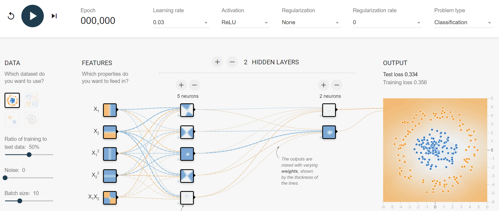


## 2. 常见激活函数

激活函数通过引入非线性来增强神经网络的表达能力，对于解决线性模型的局限性至关重要。由于反向传播算法(BP)用于更新网络参数，因此激活函数必须是可微的，也就是说能够求导的。

### 2.1 sigmoid

Sigmoid激活函数是一种常见的非线性激活函数，特别是在早期神经网络中应用广泛。它将输入映射到0到1之间的值，因此非常适合处理概率问题。

#### 2.1.1 公式

Sigmoid函数的数学表达式为：
$$
f(x) = \sigma(x) = \frac{1}{1 + e^{-x}}
$$
其中，$$e$$ 是自然常数（约等于2.718），$$x$$ 是输入。

#### 2.1.2 特征

1.  将任意实数输入映射到 (0, 1)之间，因此非常适合处理概率场景。

2. sigmoid函数一般只用于二分类的输出层。

3. 微分性质: 导数计算比较方便，可以用自身表达式来表示：
   $$
   \sigma'(x)=\sigma(x)\cdot(1-\sigma(x))
   $$

#### 2.1.3 缺点

- 梯度消失:
  - 在输入非常大或非常小时，Sigmoid函数的梯度会变得非常小，接近于0。这导致在反向传播过程中，梯度逐渐衰减。
  - 最终使得早期层的权重更新非常缓慢，进而导致训练速度变慢甚至停滞。
- 信息丢失：输入100和输入10000经过sigmoid的激活值几乎都是等于 1 的，但是输入的数据却相差 100 倍。
- 计算成本高: 由于涉及指数运算，Sigmoid的计算比ReLU等函数更复杂，尽管差异并不显著。

#### 2.1.4 函数绘制

通过代码实现函数和导函数绘制：

```python
import torch
import matplotlib.pyplot as plt

# plt支持中文
plt.rcParams["font.sans-serif"] = ["SimHei"]
plt.rcParams["axes.unicode_minus"] = False


def test001():
    # 一行两列绘制图像
    _, ax = plt.subplots(1, 2)
    # 绘制函数图像
    x = torch.linspace(-10, 10, 100)
    y = torch.sigmoid(x)
    # 网格
    ax[0].grid(True)
    ax[0].set_title("sigmoid 函数曲线图")
    ax[0].set_xlabel("x")
    ax[0].set_ylabel("y")
    # 在第一行第一列绘制sigmoid函数曲线图
    ax[0].plot(x, y)

    # 绘制sigmoid导数曲线图
    x = torch.linspace(-10, 10, 100, requires_grad=True)
    # y = torch.sigmoid(x) * (1 - torch.sigmoid(x))
    # 自动求导
    torch.sigmoid(x).sum().backward()
    ax[1].grid(True)
    ax[1].set_title("sigmoid 函数导数曲线图", color="red")
    ax[1].set_xlabel("x")
    ax[1].set_ylabel("y")
    # ax[1].plot(x.detach().numpy(), y.detach())
    # 用自动求导的结果绘制曲线图
    ax[1].plot(x.detach().numpy(), x.grad.detach().numpy())
    # 设置曲线颜色
    ax[1].lines[0].set_color("red")

    plt.show()


if __name__ == "__main__":
    test001()

```

运行结果：

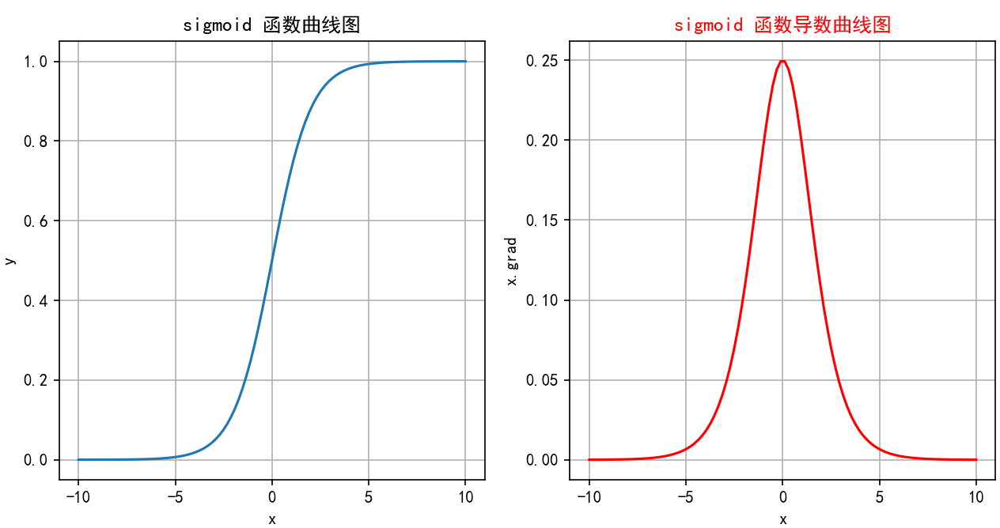

### 2.2 tanh

tanh(双曲正切)是一种常见的非线性激活函数，常用于神经网络的隐藏层。tanh 函数也是一种S形曲线，输出范围为$$(−1,1)$$。

#### 2.2.1 公式

tanh数学表达式为：
$$
{tanh}(x) = \frac{e^x - e^{-x}}{e^x + e^{-x}}
$$


#### 2.2.2 特征

1. 输出范围: 将输入映射到$$(-1, 1)$$之间，因此输出是零中心的。相比于Sigmoid函数，这种零中心化的输出有助于加速收敛。

2. 对称性: Tanh函数是关于原点对称的奇函数，因此在输入为0时，输出也为0。这种对称性有助于在训练神经网络时使数据更平衡。

3. 平滑性: Tanh函数在整个输入范围内都是连续且可微的，这使其非常适合于使用梯度下降法进行优化。
   $$
   \frac{d}{dx} \text{tanh}(x) = 1 - \text{tanh}^2(x)
   $$
   

#### 2.2.3 缺点

1. 梯度消失: 虽然一定程度上改善了梯度消失问题，但在输入值非常大或非常小时导数还是非常小，这在深层网络中仍然是个问题。这是因为每一层的梯度都会乘以一个小于1的值，经过多层乘积后，梯度会变得非常小，导致训练过程变得非常缓慢，甚至无法收敛。
2. 计算成本: 由于涉及指数运算，Tanh的计算成本还是略高，尽管差异不大。

#### 2.2.4 函数绘制

绘制代码：

```python
import torch
import matplotlib.pyplot as plt

# plt支持中文
plt.rcParams["font.sans-serif"] = ["SimHei"]
plt.rcParams["axes.unicode_minus"] = False


def test001():
    # 一行两列绘制图像
    _, ax = plt.subplots(1, 2)
    # 绘制函数图像
    x = torch.linspace(-10, 10, 100)
    y = torch.tanh(x)
    # 网格
    ax[0].grid(True)
    ax[0].set_title("tanh 函数曲线图")
    ax[0].set_xlabel("x")
    ax[0].set_ylabel("y")
    # 在第一行第一列绘制tanh函数曲线图
    ax[0].plot(x, y)

    # 绘制tanh导数曲线图
    x = torch.linspace(-10, 10, 100, requires_grad=True)
    # y = torch.tanh(x) * (1 - torch.tanh(x))
    # 自动求导：需要标量才能反向传播
    torch.tanh(x).sum().backward()
    ax[1].grid(True)
    ax[1].set_title("tanh 函数导数曲线图", color="red")
    ax[1].set_xlabel("x")
    ax[1].set_ylabel("x.grad")
    # ax[1].plot(x.detach().numpy(), y.detach())
    # 用自动求导的结果绘制曲线图
    ax[1].plot(x.detach().numpy(), x.grad.detach().numpy())
    # 设置曲线颜色
    ax[1].lines[0].set_color("red")

    plt.show()


if __name__ == "__main__":
    test001()

```


绘制结果：

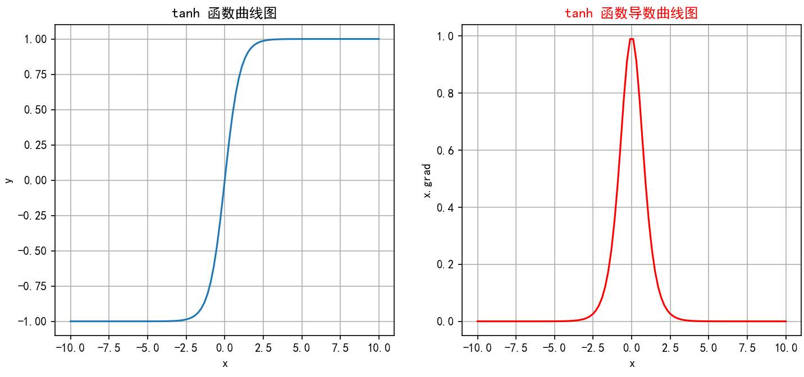

### 2.3 ReLU

ReLU（Rectified Linear Unit）是深度学习中最常用的激活函数之一，它的全称是**修正线性单元**。ReLU 激活函数的定义非常简单，但在实践中效果非常好。

#### 2.3.1 公式

ReLU 函数定义如下：
$$
\text{ReLU}(x) = \max(0, x)
$$


即$$ReLU$$对输入$$x$$进行非线性变换：
$$
\bullet\quad\text{当 }x>0\text{ 时,ReLU}(x)=x\text{}\\\bullet\quad\text{当 }x\leq0\text{ 时,ReLU}(x)=0\text{}
$$

#### 2.3.2 特征

1. 计算简单：ReLU 的计算非常简单，只需要对输入进行一次比较运算，这在实际应用中大大加速了神经网络的训练。

2. ReLU 函数的导数是分段函数：
   $$
   \text{ReLU}'(x)=\begin{cases}1,&\text{if } x>0\\0,&\text{if }x\leq0\end{cases}
   $$

3. 缓解梯度消失问题：相比于 Sigmoid 和 Tanh 激活函数，ReLU 在正半区的导数恒为 1，这使得深度神经网络在训练过程中可以更好地传播梯度，不存在饱和问题。

4. 稀疏激活：ReLU在输入小于等于 0 时输出为 0，这使得 ReLU 可以在神经网络中引入稀疏性（即一些神经元不被激活），这种稀疏性可以减少网络中的冗余信息，提高网络的效率和泛化能力。


#### 2.3.3 缺点

神经元死亡：由于$$ReLU$$在$$x≤0$$时输出为$$0$$，如果某个神经元输入值是负，那么该神经元将永远不再激活，成为“死亡”神经元。随着训练的进行，网络中可能会出现大量死亡神经元，从而会降低模型的表达能力。

#### 2.3.4 函数绘图

参考代码如下：

```python
import torch
import torch.nn.functional as F
import matplotlib.pyplot as plt

# 中文问题
plt.rcParams["font.sans-serif"] = ["SimHei"]
plt.rcParams["axes.unicode_minus"] = False


def test006():
    # 输入数据x
    x = torch.linspace(-20, 20, 1000)
    y = F.relu(x)
    # 绘制一行2列
    _, ax = plt.subplots(1, 2)
    ax[0].plot(x.numpy(), y.numpy())
    # 显示坐标格子
    ax[0].grid()
    ax[0].set_title("relu 激活函数")
    ax[0].set_xlabel("x")
    ax[0].set_ylabel("y")

    # 绘制导数函数
    x = torch.linspace(-20, 20, 1000, requires_grad=True)
    F.relu(x).sum().backward()
    ax[1].plot(x.detach().numpy(), x.grad.numpy())
    ax[1].grid()
    ax[1].set_title("relu 激活函数导数", color="red")
    # 设置绘制线色颜色
    ax[1].lines[0].set_color("red")
    ax[1].set_xlabel("x")
    ax[1].set_ylabel("x.grad")

    plt.show()


if __name__ == "__main__":
    test006()

```


执行结果如下：

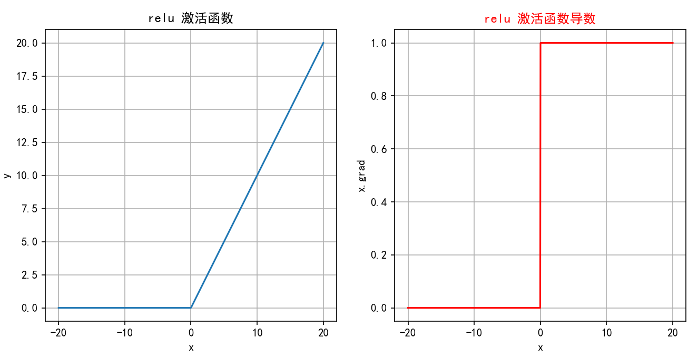

### 2.4 LeakyReLU

Leaky ReLU是一种对 ReLU 函数的改进，旨在解决 ReLU 的一些缺点，特别是**Dying ReLU** 问题。Leaky ReLU 通过在输入为负时引入一个小的负斜率来改善这一问题。

#### 2.4.1 公式

Leaky ReLU 函数的定义如下：
$$
\text{Leaky ReLU}(x)=\begin{cases}x,&\text{if } x>0\\\alpha x,&\text{if } x\leq0\end{cases}
$$
其中，$$\alpha$$ 是一个非常小的常数（如 0.01），它控制负半轴的斜率。这个常数 $$\alpha$$是一个超参数，可以在训练过程中可自行进行调整。


#### 2.4.2 特征

1. 避免神经元死亡：通过在$$x\leq 0$$ 区域引入一个小的负斜率，这样即使输入值小于等于零，Leaky ReLU仍然会有梯度，允许神经元继续更新权重，避免神经元在训练过程中完全“死亡”的问题。
2. 计算简单：Leaky ReLU 的计算与 ReLU 相似，只需简单的比较和线性运算，计算开销低。

#### 2.4.3 缺点

1. 参数选择：$$\alpha$$ 是一个需要调整的超参数，选择合适的$$\alpha$$ 值可能需要实验和调优。
2. 出现负激活：如果$$\alpha$$ 设定得不当，仍然可能导致激活值过低。

#### 2.4.4 函数绘制

参考代码：

```python
import torch
import torch.nn.functional as F
import matplotlib.pyplot as plt

# 中文设置
plt.rcParams["font.sans-serif"] = ["SimHei"]
plt.rcParams["axes.unicode_minus"] = False


def test006():
    x = torch.linspace(-5, 5, 200)
    # 设置leaky_relu的负斜率超参数
    slope = 0.03
    y = F.leaky_relu(x, slope)
    # 一行两列
    _, ax = plt.subplots(1, 2)
    # 开始绘制函数曲线图
    ax[0].plot(x, y)
    ax[0].set_title("Leaky ReLU 函数曲线图")
    ax[0].set_xlabel("x")
    ax[0].set_ylabel("y")
    ax[0].grid(True)

    # 绘制leaky_relu的梯度曲线图
    x = torch.linspace(-5, 5, 200, requires_grad=True)
    F.leaky_relu(x, slope).sum().backward()
    ax[1].plot(x.detach().numpy(), x.grad)
    ax[1].set_title("Leaky ReLU 梯度曲线图", color="red")
    ax[1].set_xlabel("x")
    ax[1].set_ylabel("x.grad")
    ax[1].grid(True)
    # 设置线的颜色
    ax[1].lines[0].set_color("red")

    plt.show()


if __name__ == "__main__":
    test006()

```


运行结果：

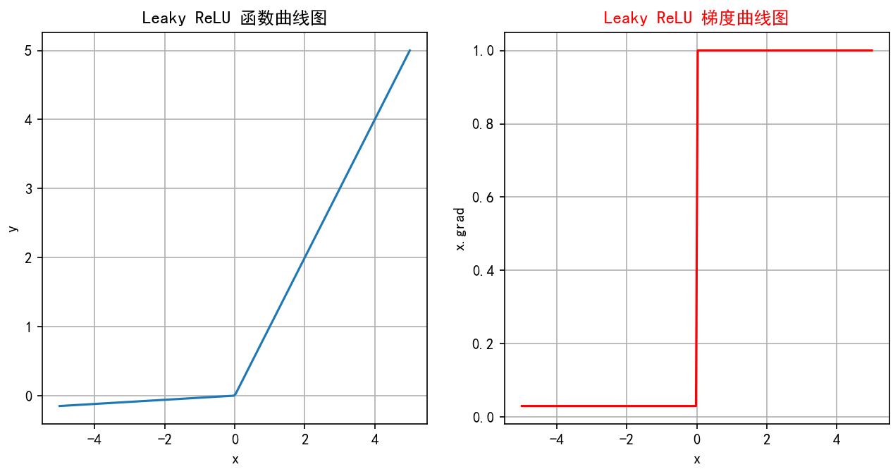

### 2.5 softmax

Softmax激活函数通常用于分类问题的**输出层**，它能够将网络的输出转换为概率分布，使得输出的各个类别的概率之和为 1。Softmax 特别适合用于多分类问题。

#### 2.5.1 公式

假设神经网络的输出层有$$n$$个节点，每个节点的输入为$$z_i$$，则 Softmax 函数的定义如下：
$$
\mathrm{Softmax}(z_i)=\frac{e^{z_i}}{\sum_{j=1}^ne^{z_j}}
$$

给定输入向量 $z=[z_1,z_2,…,z_n]$

1.指数变换：对每个 $z_i$进行指数变换，得到 $t = [e^{z_1},e^{z_2},...,e^{z_n}]$，使z的取值区间从$(-\infty,+\infty)$变为$(0,+\infty)$

2.将所有指数变换后的值求和，得到$s = e^{z_1} + e^{z_2} + ... + e^{z_n} = \Sigma_{j=1}^ne^{z_j}$

3.将t中每个 $e^{z_i}$除以归一化因子s，得到概率分布:
$$
softmax(z) =[\frac{e^{z_1}}{s},\frac{e^{z_2}}{s},...,\frac{e^{z_n}}{s}]=[\frac{e^{z_1}}{\Sigma_{j=1}^ne^{z_j}},\frac{e^{z_2}}{\Sigma_{j=1}^ne^{z_j}},...,\frac{e^{z_n}}{\Sigma_{j=1}^ne^{z_j}}]
$$
即：
$$
\mathrm{Softmax}(z_i)=\frac{e^{z_i}}{\sum_{j=1}^ne^{z_j}}
$$
从上述公式可以看出：

1. 每个输出值在 (0,1)之间

2. Softmax()对向量的值做了改变，但其位置不变

3. 所有输出值之和为1，即 

$$
sum(softmax(z)) =\frac{e^{z_1}}{s}+\frac{e^{z_2}}{s}+...+\frac{e^{z_n}}{s}=\frac{s}{s}=1
$$

#### 2.5.2 特征

1. 将输出转化为概率：通过$$Softmax$$，可以将网络的原始输出转化为各个类别的概率，从而可以根据这些概率进行分类决策。

   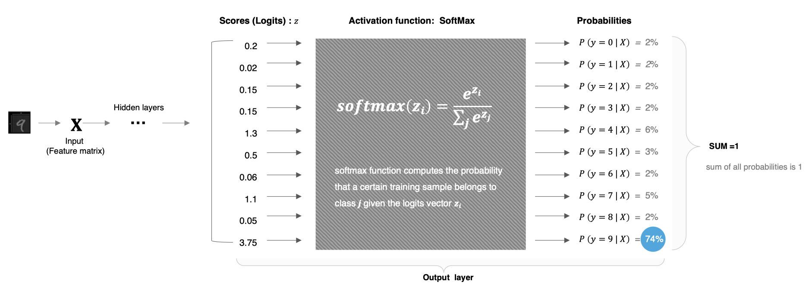

2. 概率分布：$$Softmax$$的输出是一个概率分布，即每个输出值$$\text{Softmax}(z_i)$$都是一个介于$$0$$和$$1$$之间的数，并且所有输出值的和为 1：
   $$
   \sum_{i=1}^n\text{Softmax}(z_i)=1
   $$

3. 突出差异：$$Softmax$$会放大差异，使得概率最大的类别的输出值更接近$$1$$，而其他类别更接近$$0$$。

4. 在实际应用中，$$Softmax$$常与交叉熵损失函数Cross-Entropy Loss结合使用，用于多分类问题。在反向传播中，$$Softmax$$的导数计算是必需的。

   

$$
\begin{aligned}
&\text{设 }p_i=\mathrm{Softmax}(z_i)\text{,则对于 }z_i\text{ 的导数为:} \\
&\bullet\text{ 当 }i=j\text{ 时:} \\
&&&\frac{\partial p_i}{\partial z_i}=\frac{e^{z_i}(\Sigma_{j=1}^ne^{z_j})-e^{z_i}e^{z_i}}{(\Sigma_{j=1}^ne^{z_j})^2}=p_i(1-p_i) \\
& \bullet\text{ 当 }i\neq j\text{ 时}: \\
&&&\frac{\partial p_i}{\partial z_j}=\frac{0(\Sigma_{j=1}^ne^{z_j})-e^{z_i}e^{z_j}}{(\Sigma_{j=1}^ne^{z_j})^2} =-p_{i}p_{j} 
\end{aligned}
$$

#### 2.5.3 缺点

1. 数值不稳定性：在计算过程中，如果$$z_i$$的数值过大，$$e^{z_i}$$可能会导致数值溢出。因此在实际应用中，经常会对$$z_i$$进行调整，如减去最大值以确保数值稳定。

$$
\mathrm{Softmax}(z_i)=\frac{e^{z_i-\max(z)}}{\sum_{j=1}^ne^{z_j-\max(z)}}
$$

解释：

> $$z_i-\max(z)$$是一个非正数，由于 $e^{z_i−max(z)}$ 的形式，当 $z_i$ 接近 max(*z*) 时，$e^{z_i−max(z)}$ 的值会接近 1，而当 $z_i$ 远小于 max(*z*) 时，$e^{z_i−max(z)}$ 的值会接近 0。这使得 Softmax 函数的输出中，最大值对应的概率会相对较大，而其他值对应的概率会相对较小，从而提高数值稳定性。

> 这种调整不会改变$$Softmax$$的概率分布结果，因为从数学的角度讲相当于分子、分母都除以了$$e^{\max(z)}$$。

在 PyTorch 中，`torch.nn.functional.softmax` 函数就自动处理了数值稳定性问题。

2. 难以处理大量类别：$$Softmax$$在处理类别数非常多的情况下（如大模型中的词汇表）计算开销会较大。

#### 2.5.4 代码实现

代码参考如下：

```python
import torch
import torch.nn as nn

# 表示4分类，每个样本全连接后得到4个得分，下面示例模拟的是两个样本的得分
input_tensor = torch.tensor([[-1.0, 2.0, -3.0, 4.0], [-2, 3, -3, 9]])

softmax = nn.Softmax()
output_tensor = softmax(input_tensor)
# 关闭科学计数法
torch.set_printoptions(sci_mode=False)
print("输入张量:", input_tensor)
print("输出张量:", output_tensor)

```

输出结果：

```python
输入张量: tensor([[-1.,  2., -3.,  4.],
        [-2.,  3., -3.,  9.]])
输出张量: tensor([[    0.0059,     0.1184,     0.0008,     0.8749],
        [    0.0000,     0.0025,     0.0000,     0.9975]])
```

## 3. 如何选择

更多激活函数可以查看官方文档：https://pytorch.org/docs/stable/nn.html#non-linear-activations-weighted-sum-nonlinearity

那这么多激活函数应该如何选择呢？实际没那么纠结

### 3.1 隐藏层

1. 优先选ReLU；
2. 如果ReLU效果不咋地，那么尝试其他激活，如Leaky ReLU等；
3. 使用ReLU时注意神经元死亡问题， 避免出现过多神经元死亡；
4. 避免使用sigmoid，尝试使用tanh；

### 3.2 输出层

1. 二分类问题选择sigmoid激活函数；
2. 多分类问题选择softmax激活函数；

# 五、参数初始化

神经网络的参数初始化是训练深度学习模型的关键步骤之一。初始化参数（通常是权重和偏置）会对模型的训练速度、收敛性以及最终的性能产生重要影响。下面是关于神经网络参数初始化的一些常见方法及其相关知识点。

官方文档参考：https://pytorch.org/docs/stable/nn.init.html

## 1. 固定值初始化

固定值初始化是指在神经网络训练开始时，将所有权重或偏置初始化为一个特定的常数值。这种初始化方法虽然简单，但在实际深度学习应用中通常并不推荐。

### 1.1 全零初始化

将神经网络中的所有权重参数初始化为0。

**方法**：将所有权重初始化为零。

**缺点**：导致对称性破坏，每个神经元在每一层中都会执行相同的计算，模型无法学习。

**应用场景**：通常不用来初始化权重，但可以用来初始化偏置。

**对称性问题**

- 现象：同一层的所有神经元具有完全相同的初始权重和偏置。
- 后果：
  - 在反向传播时，所有神经元会收到相同的梯度，导致权重更新完全一致。
  - 无论训练多久，同一层的神经元本质上会保持相同的功能（相当于“一个神经元”的多个副本），极大降低模型的表达能力。

代码演示：

```python
import torch
import torch.nn as nn

def test004():
    # 3. 全0参数初始化
    linear = nn.Linear(in_features=6, out_features=4)
    # 初始化权重参数
    nn.init.zeros_(linear.weight)
    # 打印权重参数
    print(linear.weight)


if __name__ == "__main__":
    test004()

```

打印结果：

```python
Parameter containing:
tensor([[0., 0., 0., 0., 0., 0.],
        [0., 0., 0., 0., 0., 0.],
        [0., 0., 0., 0., 0., 0.],
        [0., 0., 0., 0., 0., 0.]], requires_grad=True)
```

### 1.2 全1初始化

全1初始化会导致网络中每个神经元接收到相同的输入信号，进而输出相同的值，这就无法进行学习和收敛。所以全1初始化只是一个理论上的初始化方法，但在实际神经网络的训练中并不适用。

代码演示：

```python
import torch
import torch.nn as nn


def test003():
    # 3. 全1参数初始化
    linear = nn.Linear(in_features=6, out_features=4)
    # 初始化权重参数
    nn.init.ones_(linear.weight)
    # 打印权重参数
    print(linear.weight)


if __name__ == "__main__":
    test003()

```

输出结果：

```python
Parameter containing:
tensor([[1., 1., 1., 1., 1., 1.],
        [1., 1., 1., 1., 1., 1.],
        [1., 1., 1., 1., 1., 1.],
        [1., 1., 1., 1., 1., 1.]], requires_grad=True)
```

### 1.3 任意常数初始化

将所有参数初始化为某个非零的常数（如 0.1，-1 等）。虽然不同于全0和全1，但这种方法依然不能避免对称性破坏的问题。

```python
import torch
import torch.nn as nn


def test002():
    # 2. 固定值参数初始化
    linear = nn.Linear(in_features=6, out_features=4)
    # 初始化权重参数
    nn.init.constant_(linear.weight, 0.63)
    # 打印权重参数
    print(linear.weight)
    pass


if __name__ == "__main__":
    test002()

```

输出结果：

```python
Parameter containing:
tensor([[0.6300, 0.6300, 0.6300, 0.6300, 0.6300, 0.6300],
        [0.6300, 0.6300, 0.6300, 0.6300, 0.6300, 0.6300],
        [0.6300, 0.6300, 0.6300, 0.6300, 0.6300, 0.6300],
        [0.6300, 0.6300, 0.6300, 0.6300, 0.6300, 0.6300]], requires_grad=True)
```

参考2：

```python
import torch
import torch.nn as nn


def test002():
    net = nn.Linear(2, 2, bias=True)
    # 假设一个数值
    x = torch.tensor([[0.1, 0.95]])

    # 初始化权重参数
    net.weight.data = torch.tensor([
        [0.1, 0.2], 
        [0.3, 0.4]
    ])

    # 输出什么：权重参数会转置
    output = net(x)
    print(output, net.bias)
    pass


if __name__ == "__main__":
    test002()

```

- 所有输入特征被同等对待
- 无法学习特征间的不同重要性

## 2. 随机初始化

**方法**：将权重初始化为随机的小值，通常从正态分布或均匀分布中采样。

**应用场景**：这是最基本的初始化方法，通过随机初始化避免对称性破坏。

代码演示：随机分布之均匀初始化

```python
import torch
import torch.nn as nn


def test001():
    # 1. 均匀分布随机初始化
    linear = nn.Linear(in_features=6, out_features=4)
    # 初始化权重参数
    nn.init.uniform_(linear.weight)
    # 打印权重参数
    print(linear.weight)


if __name__ == "__main__":
    test001()

```

打印结果：

```python
Parameter containing:
tensor([[0.4080, 0.7444, 0.7616, 0.0565, 0.2589, 0.0562],
        [0.1485, 0.9544, 0.3323, 0.9802, 0.1847, 0.6254],
        [0.6256, 0.2047, 0.5049, 0.3547, 0.9279, 0.8045],
        [0.1994, 0.7670, 0.8306, 0.1364, 0.4395, 0.0412]], requires_grad=True)
```

代码演示：正态分布初始化

```python
import torch
import torch.nn as nn


def test005():
    # 5. 正太分布初始化
    linear = nn.Linear(in_features=6, out_features=4)
    # 初始化权重参数
    nn.init.normal_(linear.weight, mean=0, std=1)
    # 打印权重参数
    print(linear.weight)


if __name__ == "__main__":
    test005()

```

打印结果：

```python
Parameter containing:
tensor([[ 1.5321,  0.2394,  0.0622,  0.4482,  0.0757, -0.6056],
        [ 1.0632,  1.8069,  1.1189,  0.2448,  0.8095, -0.3486],
        [-0.8975,  1.8253, -0.9931,  0.7488,  0.2736, -1.3892],
        [-0.3752,  0.0500, -0.1723, -0.4370, -1.5334, -0.5393]],
       requires_grad=True)
```

## 3. Xavier 初始化

**前置知识**：

均匀分布：

均匀分布的概率密度函数（PDF）：
$$
p(x)=\begin{cases}\frac{1}{b−a} & 如果 a≤x≤b\\
0 & 其他情况
\end{cases}
$$
计算期望值（均值）：
$$
E[X]=∫_a^bx⋅p(x) dx=∫_a^bx⋅\frac{1}{b−a} dx=\frac{a+b}{2}
$$
计算方差（二阶矩减去均值的平方）：
$$
Var(X)=E(X-E(X))^2=E[X^2]−(E[X])^2
$$

- 先计算 $E[X^2]$：
  $$
  E[X^2]=∫_a^bx^2⋅\frac{1}{b−a} dx=\frac{b^3−a^3}{3(b−a)}=\frac{a^2+ab+b^2}{3}
  $$

- 代入方差公式：
  $$
  Var(X)=\frac{a^2+ab+b^2}{3}−(\frac{a+b}{2})^2=\frac{(b−a)^2}{12}
  $$

Xavier 初始化（由 Xavier Glorot 在 2010 年提出）是一种**自适应权重初始化方法**，专门为解决神经网络训练初期的梯度消失或爆炸问题而设计。Xavier 初始化也叫做Glorot初始化。Xavier 初始化的核心思想是根据输入和输出的维度来初始化权重，使得每一层的输出的方差保持一致。具体来说，权重的初始化范围取决于前一层的神经元数量（输入维度）和当前层的神经元数量（输出维度）。

**方法**：根据输入和输出神经元的数量来选择权重的初始值。 

数学原理：

**(1) 前向传播的方差一致性**

假设输入 x 的均值为 0，方差为 $σ_x^2$，权重 W的均值为 0，方差为 $σ_W^2$，则输出 $z=Wx$的方差为：
$$
Var(z)=n_{in}⋅Var(W)⋅Var(x)
$$
为了使 Var(z)=Var(x)，需要：
$$
n_{in}⋅Var(W)=1  ⟹  Var(W)=\frac{1}{n_{in}}
$$
其中 $n_{in}$是输入维度（fan_in）。这里乘以 *n*in 的原因是，输出 *z* 是由 *n*in 个输入 *x* 的线性组合得到的，每个输入 *x* 都与一个权重 *W* 相乘。因此，输出 *z* 的方差是 *n*in 个独立的 Wx 项的方差之和。

**(2) 反向传播的梯度方差一致性**

在反向传播过程中，梯度 $\frac{∂L}{∂x}$ 是通过链式法则计算得到的，其中 *L* 是损失函数，*x* 是输入，*z* 是输出。梯度$\frac{∂L}{∂x}$可以表示为： 
$$
\frac{∂L}{∂x}=\frac{∂L}{∂z}.\frac{∂z}{∂x}
$$
假设 *z*=*Wx*，其中 *W* 是权重矩阵，那么 $\frac{∂z}{∂x}=W$。因此，梯度  $\frac{∂L}{∂x}$可以写为： $\frac{∂L}{∂x}=\frac{∂L}{∂z}W$

反向传播时梯度 $\frac{∂L}{∂x}$ 的方差应与 $\frac{∂L}{∂z}$ 相同，因此：
$$
n_{out}⋅Var(W)=1  ⟹  Var(W)=\frac{1}{n_{out}}
$$
其中 $n_{out}$是输出维度（fan_out）。为了保持梯度的方差一致性，我们需要确保每个输入维度 *n*in 的梯度方差与输出维度 *n*out 的梯度方差相同。因此，我们需要将 *W* 的方差乘以 *n*out，以确保梯度的方差在反向传播过程中保持一致。

**(3) 综合考虑**

为了同时平衡前向传播和反向传播，Xavier 采用：
$$
Var(W)=\frac{2}{n_{in}+n_{out}}
$$
权重从以下分布中采样：

**均匀分布**：
$$
W\sim\mathrm{U}\left(-\frac{\sqrt{6}}{\sqrt{n_\mathrm{in}+n_\mathrm{out}}},\frac{\sqrt{6}}{\sqrt{n_\mathrm{in}+n_\mathrm{out}}}\right)
$$


在Xavier初始化中，我们选择 $a=−\sqrt{\frac{6}{n_{in}+n_{out}}}$ 和 $b=\sqrt{\frac{6}{n_{in}+n_{out}}}$，这样方差为： 
$$
Var(W)=\frac{(b−a)^2}{12}=\frac{(2\sqrt{\frac{6}{n_{in}+n_{out}}})^2}{12}=\frac{4⋅\frac{6}{nin+nout}}{12}=\frac{2}{n_{in}+n_{out}}
$$
**正态分布**：
$$
W\sim\mathrm{N}\left(0,\frac{2}{n_\mathrm{in}+n_\mathrm{out}}\right)
$$

$$
\mathcal{N}(0, \text{std}^2)
$$

其中 $$n_{\text{in}}$$ 是当前层的输入神经元数量，$$n_{\text{out}}$$是输出神经元数量。

在前向传播中，输出的方差受 $n_{in}$ 影响。在反向传播中，梯度的方差受 $n_{out}$ 影响。

**优点**：平衡了输入和输出的方差，适合$$Sigmoid$$ 和 $$Tanh$$ 激活函数。

**应用场景**：常用于浅层网络或使用$$Sigmoid$$ 、$$Tanh$$ 激活函数的网络。

代码演示：

```python
import torch
import torch.nn as nn


def test007():
    # Xavier初始化：正态分布
    linear = nn.Linear(in_features=6, out_features=4)
    nn.init.xavier_normal_(linear.weight)
    print(linear.weight)

    # Xavier初始化：均匀分布
    linear = nn.Linear(in_features=6, out_features=4)
    nn.init.xavier_uniform_(linear.weight)
    print(linear.weight)


if __name__ == "__main__":
    test007()

```

打印结果：

```python
Parameter containing:
tensor([[-0.4838,  0.4121, -0.3171, -0.2214, -0.8666, -0.4340],
        [ 0.1059,  0.6740, -0.1025, -0.1006,  0.5757, -0.1117],
        [ 0.7467, -0.0554, -0.5593, -0.1513, -0.5867, -0.1564],
        [-0.1058,  0.5266,  0.0243, -0.5646, -0.4982, -0.1844]],
       requires_grad=True)
Parameter containing:
tensor([[-0.5263,  0.3455,  0.6449,  0.2807, -0.3698, -0.6890],
        [ 0.1578, -0.3161, -0.1910, -0.4318, -0.5760,  0.3746],
        [ 0.2017, -0.6320, -0.4060,  0.3903,  0.3103, -0.5881],
        [ 0.6212,  0.3077,  0.0783, -0.6187,  0.3109, -0.6060]],
       requires_grad=True)
```

## 4. He初始化

也叫kaiming 初始化。He 初始化的核心思想是**调整权重的初始化范围，使得每一层的输出的方差保持一致**。与 Xavier 初始化不同，He 初始化专门针对 ReLU 激活函数的特性进行了优化。

**数学推导**

**(1) 前向传播的方差一致性**

对于 ReLU 激活函数，输出的方差为：
$$
Var(z)=\frac{1}{2}n_{in}⋅Var(W)⋅Var(x)
$$
（因为 ReLU 使一半神经元输出为 0，方差减半）
为使 Var(z)=Var(x)，需：
$$
\frac{1}{2}n_{in}⋅Var(W)=1  ⟹  Var(W)=\frac{2}{n_{in}}
$$
**(2) 反向传播的梯度一致性**

类似地，反向传播时梯度方差需满足：
$$
Var(\frac{∂L}{∂x})=\frac{1}{2}n_{out}⋅Var(W)⋅Var(\frac{∂L}{∂z})
$$
因此：
$$
Var(W)=\frac{2}{n_{out}}
$$
**(3) 两种模式**

- **`fan_in` 模式**（默认）：优先保证前向传播稳定，方差 $\frac{2}{n_{in}}$。
- **`fan_out` 模式**：优先保证反向传播稳定，方差$\frac{2}{n_{out}}$。

**方法**：专门为 ReLU 激活函数设计。权重从以下分布中采样：

均匀分布：
$$
W\sim\mathrm{U}\left(-\frac{\sqrt{6}}{\sqrt{n_\mathrm{in}}},\frac{\sqrt{6}}{\sqrt{n_\mathrm{in}}}\right)
$$
正态分布：
$$
W\sim\mathrm{N}\left(0,\frac{2}{n_\mathrm{in}}\right)
$$
其中 $$n_{\text{in}}$$ 是当前层的输入神经元数量。

**优点**：适用于$$ReLU$$ 和 $$Leaky ReLU$$ 激活函数。

**应用场景**：深度网络，尤其是使用 ReLU 激活函数时。

代码演示：

```python
import torch
import torch.nn as nn


def test006():
    # He初始化：正态分布
    linear = nn.Linear(in_features=6, out_features=4)
    nn.init.kaiming_normal_(linear.weight, nonlinearity="relu", mode='fan_in')
    print(linear.weight)

    # He初始化：均匀分布
    linear = nn.Linear(in_features=6, out_features=4)
    nn.init.kaiming_uniform_(linear.weight, nonlinearity="relu", mode='fan_out')
    print(linear.weight)


if __name__ == "__main__":
    test006()

```

输出结果：

```python
Parameter containing:
tensor([[ 1.4020,  0.2030,  0.3585, -0.7419,  0.6077,  0.0178],
        [-0.2860, -1.2135,  0.0773, -0.3750, -0.5725,  0.9756],
        [ 0.2938, -0.6159, -1.1721,  0.2093,  0.4212,  0.9079],
        [ 0.2050,  0.3866, -0.3129, -0.3009, -0.6659, -0.2261]],
       requires_grad=True)

Parameter containing:
tensor([[-0.1924, -0.6155, -0.7438, -0.2796, -0.1671, -0.2979],
        [ 0.7609,  0.9836, -0.0961,  0.7139, -0.8044, -0.3827],
        [ 0.1416,  0.6636,  0.9539,  0.4735, -0.2384, -0.1330],
        [ 0.7254, -0.4056, -0.7621, -0.6139, -0.6093, -0.2577]],
       requires_grad=True)
```

## 5. 总结

在使用Torch构建网络模型时，每个网络层的参数都有默认的初始化方法，同时还可以通过以上方法来对网络参数进行初始化。

# 六、损失函数

## 1. 线性回归损失函数

### 1.1 MAE损失

MAE（Mean Absolute Error，平均绝对误差）通常也被称为 L1-Loss，通过对预测值和真实值之间的绝对差取平均值来衡量他们之间的差异。

MAE的公式如下：
$$
\text{MAE} = \frac{1}{n} \sum_{i=1}^{n} \left| y_i - \hat{y}_i \right|
$$
其中：
- $$n$$ 是样本的总数。
- $$ y_i $$ 是第 $$i$$ 个样本的真实值。
- $$ \hat{y}_i$$ 是第 $$i$$ 个样本的预测值。
- $$\left| y_i - \hat{y}_i \right|$$ 是真实值和预测值之间的绝对误差。

**特点**：

1. **鲁棒性**：与均方误差（MSE）相比，MAE对异常值（outliers）更为鲁棒，因为它不会像MSE那样对较大误差平方敏感。
2. **物理意义直观**：MAE以与原始数据相同的单位度量误差，使其易于解释。

**应用场景**：
MAE通常用于需要对误差进行线性度量的情况，尤其是当数据中可能存在异常值时，MAE可以避免对异常值的过度惩罚。

使用`torch.nn.L1Loss`即可计算MAE：

```python
import torch
import torch.nn as nn

# 初始化MAE损失函数
mae_loss = nn.L1Loss()

# 假设 y_true 是真实值, y_pred 是预测值
y_true = torch.tensor([3.0, 5.0, 2.5])
y_pred = torch.tensor([2.5, 5.0, 3.0])

# 计算MAE
loss = mae_loss(y_pred, y_true)
print(f'MAE Loss: {loss.item()}')
```

### 1.2 MSE损失

均方差损失，也叫L2Loss。

MSE（Mean Squared Error，均方误差）通过对预测值和真实值之间的误差平方取平均值，来衡量预测值与真实值之间的差异。

MSE的公式如下：
$$
\text{MSE} = \frac{1}{n} \sum_{i=1}^{n} \left( y_i - \hat{y}_i \right)^2
$$
其中：
- $$n$$ 是样本的总数。
- $$ y_i $$ 是第 $$i$$ 个样本的真实值。
- $$ \hat{y}_i $$ 是第 $$i$$ 个样本的预测值。
- $$\left( y_i - \hat{y}_i \right)^2$$ 是真实值和预测值之间的误差平方。

**特点**：

1. 平方惩罚：因为误差平方，MSE 对较大误差施加更大惩罚，所以 MSE 对异常值更为敏感。
2. 凸性：MSE 是一个凸函数(国际的叫法，国内叫凹函数)，这意味着它具有一个唯一的全局最小值，有助于优化问题的求解。

**应用场景**：

MSE被广泛应用在神经网络中。

使用 torch.nn.MSELoss 可以实现：

```python
import torch
import torch.nn as nn

# 初始化MSE损失函数
mse_loss = nn.MSELoss()

# 假设 y_true 是真实值, y_pred 是预测值
y_true = torch.tensor([3.0, 5.0, 2.5])
y_pred = torch.tensor([2.5, 5.0, 3.0])

# 计算MSE
loss = mse_loss(y_pred, y_true)
print(f'MSE Loss: {loss.item()}')
```

## 2. CrossEntropyLoss

### 2.1 信息量

信息量用于衡量一个事件所包含的信息的多少。信息量的定义基于事件发生的概率：事件发生的概率越低，其信息量越大。其量化公式：

对于一个事件x，其发生的概率为 P(x)，信息量I(x) 定义为：
$$
I(x)=−logP(x)
$$
性质

1. 非负性：I(x)≥0。
2. 单调性：P(x)越小，I(x)越大。

### 2.2 信息熵

信息熵是信息量的期望值。熵越高，表示随机变量的不确定性越大；熵越低，表示随机变量的不确定性越小。

公式由数学中的期望推导而来：
$$
H(X)=−∑_{i=1}^n P(x_i)logP(x_i)
$$
其中：

$-logP(x_i)$是信息量，$P(x_i)$是信息量对应的概率

### 2.3 KL散度

KL散度用于衡量两个概率分布之间的差异。它描述的是用一个分布 Q来近似另一个分布 P时，所损失的信息量。KL散度越小，表示两个分布越接近。

对于两个离散概率分布 P和 Q，KL散度定义为：
$$
D_{KL}(P||Q)=∑_iP(x_i)log\frac{⁡P(x_i)}{Q(x_i)}
$$
其中：*P* 是真实分布，Q是近似分布。

### 2.4 交叉熵

对KL散度公式展开：
$$
D_{KL}(P||Q)=∑_iP(x_i)log\frac{⁡P(x_i)}{Q(x_i)}=∑_iP(x_i)[log{⁡P(x_i)}-log{Q(x_i)}]\\
=∑_iP(x_i)log{⁡P(x_i)}-∑_iP(x_i)log{Q(x_i)}=-(-∑_iP(x_i)log{⁡P(x_i)})+(-∑_iP(x_i)log{Q(x_i)})\\
=-H(P)+(-∑_iP(x_i)log{Q(x_i)})\\
=H(P,Q)-H(P)
$$
由上述公式可知，P是真实分布，H(P)是常数，所以KL散度可以用H(P,Q)来表示；H(P,Q)叫做交叉熵。

如果将P换成y，Q换成$\hat{y}$,则交叉熵公式为：
$$
\text{CrossEntropyLoss}(y, \hat{y}) = - \sum_{i=1}^{C} y_i \log(\hat{y}_i)
$$

其中：

- $$C$$ 是类别的总数。
- $$ y $$ 是真实标签的one-hot编码向量，表示真实类别。
- $$\hat{y}$$ 是模型的输出（经过 softmax 后的概率分布）。
- $$y_i$$ 是真实类别的第 $$i$$ 个元素（0 或 1）。
- $$ \hat{y}_i $$ 是预测的类别概率分布中对应类别 $$i$$ 的概率。

函数曲线图：

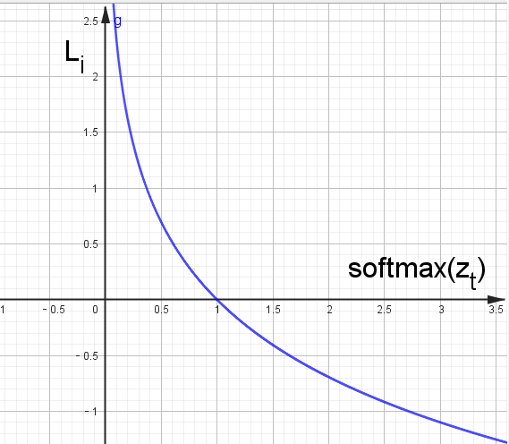

**特点：**

1. 概率输出：CrossEntropyLoss 通常与 softmax 函数一起使用，使得模型的输出表示为一个概率分布（即所有类别的概率和为 1）。PyTorch 的 nn.CrossEntropyLoss 已经**内置了 Softmax 操作**。如果我们在输出层显式地添加 Softmax，会导致重复应用 Softmax，从而影响模型的训练效果。

2. 惩罚错误分类：该损失函数在真实类别的预测概率较低时，会施加较大的惩罚，这样模型在训练时更注重提升正确类别的预测概率。

3. 多分类问题中的标准选择：在大多数多分类问题中，CrossEntropyLoss 是首选的损失函数。

**应用场景：**

CrossEntropyLoss 广泛应用于各种分类任务，包括图像分类、文本分类等，尤其是在神经网络模型中。

nn.CrossEntropyLoss基本原理：

由交叉熵公式可知：
$$
\text{Loss}(y, \hat{y}) = - \sum_{i=1}^{C} y_i \log(\hat{y}_i)
$$
因为$y_i$是one-hot编码，其值不是1便是0，又是乘法，所以只要知道1对应的index就可以了，展开后：
$$
\text{Loss}(y, \hat{y}) = - \log(\hat{y}_m)
$$
其中，m表示真实类别。

因为神经网络最后一层分类总是接softmax，所以可以把$\hat{y}_m$直接看为是softmax后的结果。
$$
\text{Loss}(i) = - \log(softmax(x_i))
$$
所以，`CrossEntropyLoss` 实质上是两步的组合：Cross Entropy = Log-Softmax + NLLLoss

- **Log-Softmax**：对输入 logits 先计算对数 softmax：`log(softmax(x))`。
- **NLLLoss（Negative Log-Likelihood）**：对 log-softmax 的结果计算负对数似然损失。简单理解就是求负数。原因是概率值通常在 0 到 1 之间，取对数后会变成负数。为了使损失值为正数，需要取负数。

对于$softmax(x_i)$，在softmax介绍中了解到，需要减去最大值以确保数值稳定。
$$
\mathrm{Softmax}(x_i)=\frac{e^{x_i-\max(x)}}{\sum_{j=1}^ne^{x_j-\max(x)}}
$$
则：
$$
LogSoftmax(x_i) =log(\frac{e^{x_i-\max(x)}}{\sum_{j=1}^ne^{x_j-\max(x)}})\\
=x_i-\max(x)-log(\sum_{j=1}^ne^{x_j-\max(x)})
$$
所以：
$$
\text{Loss}(i) = - (x_i-\max(x)-log(\sum_{j=1}^ne^{x_j-\max(x)}))
$$
总的交叉熵损失函数是所有样本的平均值： 
$$
\ell(x, y) = \begin{cases}
              \frac{\sum_{n=1}^N l_n}{N}, &
               \text{if reduction} = \text{`mean';}\\
                \sum_{n=1}^N l_n,  &
                \text{if reduction} = \text{`sum'.}
            \end{cases}
$$
示例代码如下：

```python
import torch
import torch.nn as nn

# 假设有三个类别，模型输出是未经softmax的logits
logits = torch.tensor([[1.5, 2.0, 0.5], [0.5, 1.0, 1.5]])

# 真实的标签
labels = torch.tensor([1, 2])  # 第一个样本的真实类别为1，第二个样本的真实类别为2

# 初始化CrossEntropyLoss
# 参数：reduction：mean-平均值，sum-总和
criterion = nn.CrossEntropyLoss()

# 计算损失
loss = criterion(logits, labels)
print(f'Cross Entropy Loss: {loss.item()}')
```

在这个例子中，CrossEntropyLoss 直接作用于未经 softmax 处理的 logits 输出和真实标签，PyTorch 内部会自动应用 softmax 激活函数，并计算交叉熵损失。

**分析示例中的代码：**

```python
logits = torch.tensor([[1.5, 2.0, 0.5], [0.5, 1.0, 1.5]])
```

第一个样本的得分是 `[1.5, 2.0, 0.5]`，分别对应类别 0、1 和 2 的得分。

第二个样本的得分是 `[0.5, 1.0, 1.5]`，分别对应类别 0、1 和 2 的得分

```python
labels = torch.tensor([1, 2])
```

第一个样本的真实类别是 1。

第二个样本的真实类别是 2。

`CrossEntropyLoss` 的计算过程可以分为以下几个步骤：

(1) LogSoftmax 操作

首先，对每个样本的 logits 应用 `LogSoftmax` 函数，将 logits 转换为概率分布。`LogSoftmax` 函数的公式是： $LogSoftmax(x_i) 
=x_i-\max(x)-log(\sum_{j=1}^ne^{x_j-\max(x)})$

对于第一个样本 `[1.5, 2.0, 0.5]`：

减去最大值：

$x_i-\max(x)=[1.5-2.0,2.0-2.0,0.5-2.0]=[-0.5,0,-1.5]$

计算$e^{x_i-\max(x)}$：
$$
e^{x_i-\max(x)}=[e^{-0.5},e^{-0},e^{-1.5}]≈[0.6065, 1.0, 0.2231]
$$
求和并取对数：
$$
log(\sum_{j=1}^ne^{x_j-\max(x)})=log(0.6065 + 1.0 + 0.2231)=log(1.8296) ≈ 0.6041
$$
计算 `log_softmax`：
$$
LogSoftmax(x_i) 
=x_i-\max(x)-log(\sum_{j=1}^ne^{x_j-\max(x)})= [-0.5-0.6041, 0.0-0.6041, -1.5-0.6041]\\
            ≈ [-1.1041, -0.6041, -2.1041]
$$
对于第二个样本 `[0.5, 1.0, 1.5]`：

减去最大值：

$x_i-\max(x)=[0.5-1.5,1.0-1.5,1.5-1.5]=[-1.0,-0.5,0]$

计算$e^{x_i-\max(x)}$：
$$
e^{x_i-\max(x)}=[e^{-1.0},e^{-0.5},e^{0}]≈[0.3679, 0.6065, 1.0]
$$


求和并取对数：
$$
log(\sum_{j=1}^ne^{x_j-\max(x)})=log(0.3679+0.6065+1.0) =log(1.9744)≈ 0.6803
$$


计算 `log_softmax`：
$$
LogSoftmax(x_i) 
=x_i-\max(x)-log(\sum_{j=1}^ne^{x_j-\max(x)})= [-1.0-0.6803,-0.5-0.6803,0-0.6803]\\
            ≈ [-1.6803, -1.1803, -0.6803]
$$


(2) 计算每个样本的损失

接下来，根据真实标签 $z_t$ 计算每个样本的交叉熵损失。交叉熵损失的公式是： $L_i=−log(softmax(x_i))$

对于第一个样本：

- 真实类别是 1，对应的 softmax 值是 -0.6041。

对于第二个样本：

- 真实类别是 2，对应的 softmax 值是 -0.6803。

(3) 计算平均损失

最后，计算所有样本的平均损失： $平均损失=-\frac{L_1+L_2}{2}=\frac{0.6041 + 0.6803}{2}=0.6422$

## 3. BCELoss

二分类交叉熵损失函数，使用在输出层使用sigmoid激活函数进行二分类时。

由交叉熵公式：
$$
\text{CELoss}(y, \hat{y}) = - \sum_{i=1}^{C} y_i \log(\hat{y}_i)
$$
对于二分类问题，真实标签 y的值为（0 或 1），假设模型预测为正类的概率为 $\hat{y}$，则：
$$
\begin{cases} {y} & 如果 y=1\\
1−{y} & 如果 y=0

\end{cases}
$$
所以：
$$
\text{CELoss}(y, \hat{y}) = -[ylog(\hat{y}) + (1-y)log(1-\hat{y})]
$$
示例：

```py
import torch
import torch.nn as nn

# y 是模型的输出，已经被sigmoid处理过，确保其值域在(0,1)
y = torch.tensor([[0.7], [0.2], [0.9], [0.7]])
# targets 是真实的标签，0或1
t = torch.tensor([[1], [0], [1], [0]], dtype=torch.float)

# 计算损失方式一:
bceLoss = nn.BCELoss()
loss1 = bceLoss(y, t)

#计算损失方式二: 两种方式结果相同
loss2 = nn.functional.binary_cross_entropy(y, t)

print(loss1, loss2)
```

逐样本计算

| 样本 | `y_i` | `t_i` | 计算项 $t_i * log(y_i) + (1-t_i) * log(1-y_i)$ |
| :--- | :---- | :---- | :--------------------------------------------- |
| 1    | 0.7   | 1     | `1*log(0.7) + 0*log(0.3) ≈ -0.3567`            |
| 2    | 0.2   | 0     | `0*log(0.2) + 1*log(0.8) ≈ -0.2231`            |
| 3    | 0.9   | 1     | `1*log(0.9) + 0*log(0.1) ≈ -0.1054`            |
| 4    | 0.7   | 0     | `0*log(0.7) + 1*log(0.3) ≈ -1.2040`            |

计算最终损失
$$
BCE=−\frac{(−0.3567)+(−0.2231)+(−0.1054)+(−1.2040)}4=\frac{0.3567+0.2231+0.1054+1.2040}4≈0.4723
$$

## 4. 总结

- 当输出层使用softmax多分类时，使用交叉熵损失函数；


- 当输出层使用sigmoid二分类时，使用二分类交叉熵损失函数， 比如在逻辑回归中使用；


- 当功能为线性回归时，使用均方差损失-L2 loss；


# 七、反向传播算法

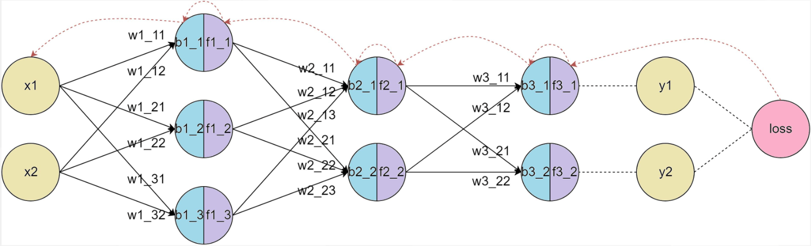

反向传播（Back Propagation，简称BP）算法是用于训练神经网络的核心算法之一，它通过计算损失函数（如均方误差或交叉熵）相对于每个权重参数的梯度，来优化神经网络的权重。

## 1. 前向传播

前向传播（Forward Propagation）把输入数据经过各层神经元的运算并逐层向前传输，一直到输出层为止。

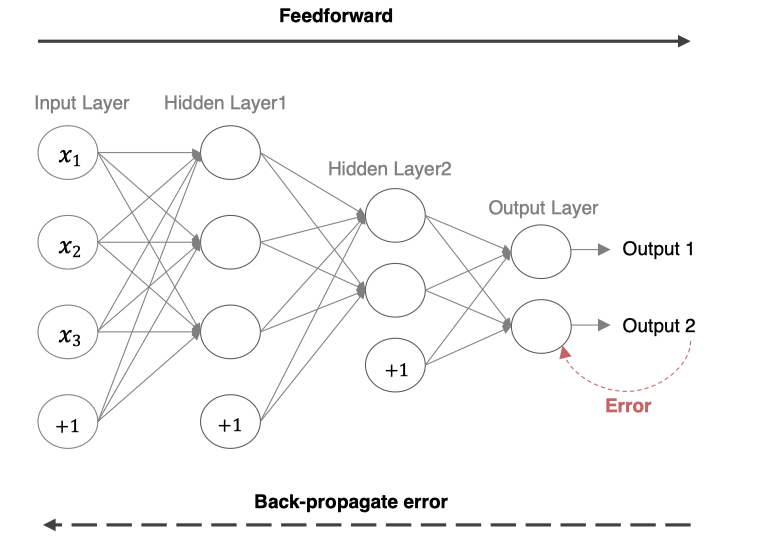

### 1.1 数学表达

下面是一个简单的三层神经网络（输入层、隐藏层、输出层）前向传播的基本步骤分析。

#### 1.1.1 输入层到隐藏层

给定输入 $$x$$ 和权重矩阵 $$W_1$$ 及偏置向量 $$b_1$$，隐藏层的输出（激活值）计算如下：
$$
z^{(1)} = W_1 \cdot x + b_1
$$
将$$z^{(1)}$$ 通过激活函数 $$\sigma$$进行激活：
$$
a^{(1)} = \sigma(z^{(1)})
$$

#### 1.1.2 隐藏层到输出层

隐藏层的输出 $$ a^{(1)}$$ 通过输出层的权重矩阵 $$W_2$$和偏置 $$b_2$$ 生成最终的输出：
$$
z^{(2)} = W_2 \cdot a^{(1)} + b_2
$$
输出层的激活值 $$a^{(2)}$$ 是最终的预测结果：
$$
y_{\text{pred}} = a^{(2)} = \sigma(z^{(2)})
$$

### 1.2 作用

前向传播的主要作用是：

1. 计算神经网络的输出结果，用于预测或计算损失。
2. 在反向传播中使用，通过计算损失函数相对于每个参数的梯度来优化网络。

## 2. BP基础之梯度下降算法

梯度下降算法的目标是找到使损失函数 $$L(\theta)$$ 最小的参数 $$\theta$$，其核心是沿着损失函数梯度的负方向更新参数，以逐步逼近局部或全局最优解，从而使模型更好地拟合训练数据。

### 2.1 数学描述

简单回顾下数学知识。

####  2.1.1 数学公式

$$
w_{ij}^{new}= w_{ij}^{old} - \alpha \frac{\partial E}{\partial w_{ij}}
$$

其中，$$\alpha$$是学习率：

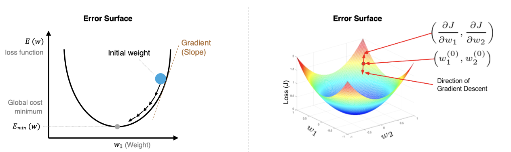


- 学习率太小，每次训练之后的效果太小，增加时间和算力成本。
- 学习率太大，大概率会跳过最优解，进入无限的训练和震荡中。
- 解决的方法就是，学习率也需要随着训练的进行而变化。

#### 2.1.2 过程阐述

1. **初始化参数**：随机初始化模型的参数 $$\theta $$，如权重 $$W$$和偏置 $$b$$。

2. **计算梯度**：损失函数 $$L(\theta)$$对参数 $$\theta$$ 的梯度 $$\nabla_\theta L(\theta)$$，表示损失函数在参数空间的变化率。

3. **更新参数**：按照梯度下降公式更新参数：$$\theta := \theta - \alpha \nabla_\theta L(\theta)$$，其中，$$\alpha$$ 是学习率，用于控制更新步长。

4. **迭代更新**：重复【计算梯度和更新参数】步骤，直到某个终止条件（如梯度接近0、不再收敛、完成迭代次数等）。

### 2.2 传统下降方式

根据计算梯度时数据量不同，常见的方式有：

#### 2. 2.1 批量梯度下降

Batch Gradient Descent  **BGD**

- **特点**：
  
  - 每次更新参数时，使用整个训练集来计算梯度。
  
- **优点**：
  
  - 收敛稳定，能准确地沿着损失函数的真实梯度方向下降。
  - 适用于小型数据集。
  
- **缺点**：
  
  - 对于大型数据集，计算量巨大，更新速度慢。
  - 需要大量内存来存储整个数据集。
  
- **公式**：
  $$
  \theta = \theta - \alpha \frac{1}{m} \sum_{i=1}^{m} \nabla_\theta L(\hat{y}^{(i)}, y^{(i)})
  $$
  其中，$$m$$ 是训练集样本总数，$$x^{(i)}, y^{(i)} $$是第 $$i$$ 个样本及其标签，$\hat{y}^{(i)}$是第 $$i$$ 个样本预测值。
  

例如，在训练集中有100个样本，迭代50轮。

那么在每一轮迭代中，都会一起使用这100个样本，计算整个训练集的梯度，并对模型更新。

所以总共会更新50次梯度。

因为每次迭代都会使用整个训练集计算梯度，所以这种方法可以得到准确的梯度方向。

但如果数据集非常大，那么就导致每次迭代都很慢，计算成本就会很高。

示例：

```python
	x = torch.randn(1000, 10)
    y = torch.randn(1000, 1)

    dataset = TensorDataset(x, y)
    dataloader = DataLoader(dataset, batch_size=len(dataset))

    model = nn.Linear(10, 1)
    criterion = nn.MSELoss()
    optimizer = optim.SGD(model.parameters(), lr=0.01)

    epochs = 100

    for epoch in range(epochs):
        for b_x, b_y in dataloader:
            optimizer.zero_grad()
            output = model(b_x)
            loss = criterion(output, b_y)
            loss.backward()
            optimizer.step()

            print('Epoch %d, Loss: %f' % (epoch, loss.item()))
```

#### 2.2.2 随机梯度下降

Stochastic Gradient Descent,  **SGD**

- **特点**：
  
  - 每次更新参数时，仅使用一个样本来计算梯度。
  
- **优点**：
  - 更新频率高，计算快，适合大规模数据集。
  - 能够跳出局部最小值，有助于找到全局最优解。

- **缺点**：
  - 收敛不稳定，容易震荡，因为每个样本的梯度可能都不完全代表整体方向。
  - 需要较小的学习率来缓解震荡。

- **公式**：
  $$
  \theta = \theta - \alpha \nabla_\theta L(\hat{y}^{(i)}, y^{(i)})
  $$
  
  
  其中，$$x^{(i)}, y^{(i)}$$ 是当前随机抽取的样本及其标签。
  

例如，如果训练集有100个样本，迭代50轮，那么每一轮迭代，会遍历这100个样本，每次会计算某一个样本的梯度，然后更新模型参数。

换句话说，100个样本，迭代50轮，那么就会更新100*50=5000次梯度。

因为每次只用一个样本训练，所以迭代速度会非常快。

但更新的方向会不稳定，这也导致随机梯度下降，可能永远都不会收敛。

不过也因为这种震荡属性，使得随机梯度下降，可以跳出局部最优解。

这在某些情况下，是非常有用的。

示例：

```python
    x = torch.randn(1000, 10)
    y = torch.randn(1000, 1)

    dataset = TensorDataset(x, y)
    dataloader = DataLoader(dataset, batch_size=1)

    model = nn.Linear(10, 1)
    criterion = nn.MSELoss()
    optimizer = optim.SGD(model.parameters(), lr=0.01)

    epochs = 100

    for epoch in range(epochs):
        for b_x, b_y in dataloader:
            optimizer.zero_grad()
            output = model(b_x)
            loss = criterion(output, b_y)
            loss.backward()
            optimizer.step()

            print('Epoch %d, Loss: %f' % (epoch, loss.item()))
```

#### 2.2.3 小批量梯度下降

Mini-batch Gradient Descent  **MGBD**

- **特点**：
  
  - 每次更新参数时，使用一小部分训练集（小批量）来计算梯度。
  
- **优点**：
  - 在计算效率和收敛稳定性之间取得平衡。
  - 能够利用向量化加速计算，适合现代硬件（如GPU）。

- **缺点**：
  
  - 选择适当的批量大小比较困难；批量太小则接近SGD，批量太大则接近批量梯度下降。
  - 通常会根据硬件算力设置为32\64\128\256等2的次方。
  
- **公式**：
  $$
  \theta := \theta - \alpha \frac{1}{b} \sum_{i=1}^{b} \nabla_\theta L(\hat{y}^{(i)}, y^{(i)})
  $$
  其中，$$b$$ 是小批量的样本数量，也就是 $$batch\_size$$。

例如，如果训练集中有100个样本，迭代50轮。

如果设置小批量的数量是20，那么在每一轮迭代中，会有5次小批量迭代。

换句话说，就是将100个样本分成5个小批量，每个小批量20个数据，每次迭代用一个小批量。

因此，按照这样的方式，会对梯度，进行50轮*5个小批量=250次更新。

示例：

```python
    x = torch.randn(1000, 10)
    y = torch.randn(1000, 1)

    dataset = TensorDataset(x, y)
	# 小批量梯度下降，每批次100个样本
    dataloader = DataLoader(dataset, batch_size=100, shuffle=True)

    model = nn.Linear(10, 1)
    criterion = nn.MSELoss()
    optimizer = optim.SGD(model.parameters(), lr=0.01)

    epochs = 100

    for epoch in range(epochs):
        for b_x, b_y in dataloader:
            optimizer.zero_grad()
            output = model(b_x)
            loss = criterion(output, b_y)
            loss.backward()
            optimizer.step()

            print('Epoch %d, Loss: %f' % (epoch, loss.item()))
```


### 2.3 存在的问题

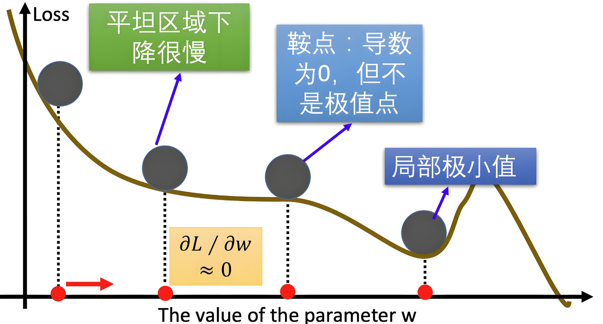


- **收敛速度慢**：BGD和MBGD使用固定学习率，太大会导致震荡，太小又收敛缓慢。

- **局部最小值和鞍点问题**：SGD在遇到局部最小值或鞍点时容易停滞，导致模型难以达到全局最优。

- **训练不稳定**：SGD中的噪声容易导致训练过程中不稳定，使得训练陷入震荡或不收敛。

### 2.4 优化下降方式

通过对标准的梯度下降进行改进，来提高收敛速度或稳定性。

#### 2.4.1 指数加权平均

​		我们平时说的平均指的是将所有数加起来除以数的个数，很单纯的数学。再一个是移动平均数，指的是计算最近邻的$$N$$个数来获得平均数，感觉比纯粹的直接全部求均值高级一点。

​		**指数加权平均**：Exponential Moving Average，简称EMA，是一种平滑时间序列数据的技术，它通过对过去的值赋予不同的权重来计算平均值。与简单移动平均不同，EMA赋予最近的数据更高的权重，较远的数据则权重较低，这样可以更敏感地反映最新的变化趋势。

​		比如今天股市的走势，和昨天发生的国际事件关系很大，和6个月前发生的事件关系相对肯定小一些。

​		给定时间序列$$\{x_t\}$$，EMA在每个时刻 $$t$$ 的值可以通过以下递推公式计算：

​		当$$t=1$$时：
$$
v_0 =  x_0
$$
​		当$$t>1$$时：
$$
v_t = \beta v_{t-1} + (1 - \beta) x_t
$$


其中：

- $$v_t$$ 是第 $$t$$ 时刻的EMA值；
- $$x_t$$ 是第 $$t$$ 时刻的观测值；
- $$\beta$$ 是平滑系数，取值范围为 $$0\leq \beta < 1$$。$$\beta$$ 越接近 $$1$$，表示对历史数据依赖性越高；越接近 $$0$$ 则越依赖当前数据。

公式推导：
$$
v_t = \beta v_{t-1} + (1 - \beta) x_t\\
v_{t-1} = \beta v_{t-2} + (1 - \beta) x_{t-1}\\
...\\

那么：\\
v_t = \beta v_{t-1} + (1 - \beta) x_t=\beta^2 v_{t-2} + \beta(1 - \beta) x_{t-1} + (1 - \beta) x_t\\
=\beta^3 v_{t-3} + \beta^2(1 - \beta) x_{t-2} + \beta(1 - \beta) x_{t-1} + (1 - \beta) x_t\\
...\\
=\beta^t {x_0} + \beta^{t-1}(1 - \beta) x_{1} + \beta^{t-2}(1 - \beta) x_{2} + ... + (1 - \beta) x_t\\
=\beta^t {x_0} + (1 - \beta)\Sigma_{i=1}^n\beta^{t-i}x_i
$$
从上述公式可知：

- 当 β接近 1 时，$β^k$衰减较慢，因此历史数据的权重较高。
- 当 β接近 0 时，$β^k$衰减较快，因此历史数据的权重较低。

**示例**

假设我们有一组数据 *x*=[1,2,3,4,5]，我们选择 β=0.1和β=0.9 来计算 EMA。

（1）β=0.1

1. 初始化：

   $EMA_0=x_0=1$

2. 计算后续值：
   $$
   EMA_1=0.1×1+0.9×2=1.9\\
   
   EMA_2=0.1×1.9+0.9×3=2.89\\
   
   EMA_3=0.1×2.89+0.9×4=3.889\\
   
   EMA_4=0.1×3.889+0.9×5=4.8889
   $$
   

最终，EMA 的值为 [1,1.9,2.89,3.889,4.8889]。

（2）β=0.9

1. 初始化：

   $EMA_0=x_0=1$

2. 计算后续值：
   $$
   EMA_1=0.9×1+0.1×2=1.1\\
   
   EMA_2=0.9×1.1+0.1×3=1.29\\
   
   EMA_3=0.9×1.29+0.1×4=1.561\\
   
   EMA_4=0.9×1.561+0.1×5=1.9049
   $$
   

最终，EMA 的值为 [1,1.1,1.29,1.561,1.9049]。

可以看到：

- 当 β=0.9 时，历史数据的权重较高，平滑效果较强。EMA值变化缓慢（新数据仅占10%权重），滞后明显。
- 当 β=0.1时，近期数据的权重较高，平滑效果较弱。EMA值快速逼近最新数据（每次新数据占90%权重）。

#### 2.4.2 Momentum

动量（Momentum）是对梯度下降的优化方法，可以更好地应对梯度变化和梯度消失问题，从而提高训练模型的效率和稳定性。它通过引入 **指数加权平均** 来积累历史梯度信息，从而在更新参数时形成“动量”，帮助优化算法更快地越过局部最优或鞍点。

梯度更新算法包括**两个步骤：**

a. 更新动量项

首先计算当前的动量项 $$v_t$$： $$v_{t} = \beta v_{t-1} + (1 - \beta) \nabla_\theta J(\theta_t)$$ 其中：

- $$v_{t-1}$$ 是之前的动量项；
- $$\beta$$ 是动量系数（通常为 0.9）；
- $$\nabla_\theta J(\theta_t)$$ 是当前的梯度；

b. 更新参数

利用动量项更新参数：
$$
v_{t}=\beta v_{t-1}+(1-\beta)\nabla_\theta J(\theta_t) 
\\
\theta_{t}=\theta_{t-1}-\eta v_{t}
$$
**特点**：

- **惯性效应：** 该方法加入前面梯度的累积，这种惯性使得算法沿着当前的方向继续更新。如遇到鞍点，也不会因梯度逼近零而停滞。

- **减少震荡：** 该方法平滑了梯度更新，减少在鞍点附近的震荡，帮助优化过程稳定向前推进。

- **加速收敛：** 该方法在优化过程中持续沿着某个方向前进，能够更快地穿越鞍点区域，避免在鞍点附近长时间停留。

**在方向上的作用**：

（1）梯度方向一致时

- 如果梯度在多个连续时刻方向一致（例如，一直指向某个方向），Momentum 会逐渐积累动量，使更新速度加快。
- 例如，假设梯度在多个时刻都是正向的，动量 $v_t$ 会逐渐增大，从而加速参数更新。

（2）梯度方向不一致时

- 如果梯度方向在不同时刻不一致（例如，来回震荡），Momentum 会通过积累的历史梯度信息部分抵消这些震荡。
- 例如，假设梯度在一个时刻是正向的，下一个时刻是负向的，动量 $v_t$ 会平滑这些变化，使更新路径更加稳定。

（3）局部最优或鞍点附近

- 在局部最优或鞍点附近，梯度可能会变得很小，导致标准梯度下降法停滞。
- Momentum 通过积累历史梯度信息，可以帮助参数更新越过这些平坦区域。

**动量方向与梯度方向一致**

（1）梯度方向一致时

- 如果梯度在多个连续时刻方向一致（例如，一直指向某个方向），动量会逐渐积累，动量方向与梯度方向一致。
- 例如，假设梯度在多个时刻都是正向的，动量 $v_t$ 会逐渐增大，从而加速参数更新。

（2）**几何意义**

- 在优化问题中，如果损失函数的几何形状是 **平滑且单调** 的（例如，一个狭长的山谷），梯度方向会保持一致。
- 在这种情况下，动量方向与梯度方向一致，Momentum 会加速参数更新，帮助算法更快地收敛。

**动量方向与梯度方向不一致**

（1）梯度方向不一致时

- 如果梯度方向在不同时刻不一致（例如，来回震荡），动量方向可能会与当前梯度方向不一致。
- 例如，假设梯度在一个时刻是正向的，下一个时刻是负向的，动量 $v_t$ 会平滑这些变化，使更新路径更加稳定。

（2）几何意义

- 在优化问题中，如果损失函数的几何形状是 **复杂且非凸** 的（例如，存在多个局部最优或鞍点），梯度方向可能会在不同时刻发生剧烈变化。
- 在这种情况下，动量方向与梯度方向可能不一致，Momentum 会通过积累的历史梯度信息部分抵消这些震荡，使更新路径更加平滑。

**总结**：

- 动量项更新：利用当前梯度和历史动量来计算新的动量项。
- 权重参数更新：利用更新后的动量项来调整权重参数。
- 梯度计算：在每个时间步计算当前的梯度，用于更新动量项和权重参数。

Momentum 算法是对梯度值的平滑调整，但是**并没有**对梯度下降中的学习率进行优化。

示例：

```python
# 定义模型和损失函数
model = nn.Linear(10, 1)
criterion = nn.MSELoss()
optimizer = torch.optim.SGD(model.parameters(), lr=0.01, momentum=0.9)  # PyTorch 中 momentum 直接作为参数

# 模拟数据
X = torch.randn(100, 10)
y = torch.randn(100, 1)

# 训练循环
for epoch in range(100):
    optimizer.zero_grad()
    outputs = model(X)
    loss = criterion(outputs, y)
    loss.backward()
    optimizer.step()
    print(f'Epoch {epoch}, Loss: {loss.item():.4f}')
```

#### 2.4.3 AdaGrad

​		AdaGrad（Adaptive Gradient Algorithm）为每个参数引入独立的学习率，它根据历史梯度的平方和来调整这些学习率。具体来说，对于频繁更新的参数，其学习率会逐渐减小；而对于更新频率较低的参数，学习率会相对较大。AdaGrad避免了统一学习率的不足，更多用于处理稀疏数据和梯度变化较大的问题。

AdaGrad流程：

1. **初始化**：
   
   - 初始化参数 $$ \theta_0 $$ 和学习率 $$ \eta $$。
   - 将梯度累积平方的向量 $$ G_0$$ 初始化为零向量。
   
2. **梯度计算**：
   
   - 在每个时间步 $$t$$，计算损失函数$$ J(\theta)$$对参数 $$\theta$$ 的梯度$$ g_t = \nabla_\theta J(\theta_t)$$。
   
3. **累积梯度的平方**：
   
   - 对每个参数 $$ i $$累积梯度的平方：
     $$
     G_{t} = G_{t-1} + g_{t}^2\\
     $$
     其中$$G_{t}$$ 是累积的梯度平方和，$$ g_{t}$$ 是第$$ i $$个参数在时间步$$t$$ 的梯度。
     
     推导：
     $$
     G_{t} = G_{t-1} + g_{t}^2=G_{t-2} + g_{t-1}^2 + g_{t}^2 = ... = g_{1}^2 + ... + g_{t-1}^2 + g_{t}^2
     $$
     
   
4. **参数更新**：
   
   - 利用累积的梯度平方来更新参数：
     $$
     \theta_{t} = \theta_{t-1} - \frac{\eta}{\sqrt{G_{t} + \epsilon}} g_{t}
     $$
     
   - 其中：
     
     - $$\eta$$ 是全局的初始学习率。
     - $$ \epsilon$$ 是一个非常小的常数，用于避免除零操作（通常取$$ 10^{-8}$$）。
     - $$ \frac{\eta}{\sqrt{G_{t} + \epsilon}} $$ 是自适应调整后的学习率。
     

AdaGrad 为每个参数分配不同的学习率：

- 对于梯度较大的参数，Gt较大，学习率较小，从而避免更新过快。
- 对于梯度较小的参数，Gt较小，学习率较大，从而加快更新速度。

可以将 AdaGrad 类比为：

- 梯度较大的参数：类似于陡峭的山坡，需要较小的步长（学习率）以避免跨度过大。
- 梯度较小的参数：类似于平缓的山坡，可以采取较大的步长（学习率）以加快收敛。

**优点**：

- 自适应学习率：由于每个参数的学习率是基于其梯度的累积平方和 $$ G_{t,i}$$ 来动态调整的，这意味着学习率会随着时间步的增加而减少，对梯度较大且变化频繁的方向非常有用，防止了梯度过大导致的震荡。
- 适合稀疏数据：AdaGrad 在处理稀疏数据时表现很好，因为它能够自适应地为那些较少更新的参数保持较大的学习率。

**缺点**：

1. 学习率过度衰减：随着时间的推移，累积的时间步梯度平方值越来越大，导致学习率逐渐接近零，模型会停止学习。
2. 不适合非稀疏数据：在非稀疏数据的情况下，学习率过快衰减可能导致优化过程早期停滞。

AdaGrad是一种有效的自适应学习率算法，然而由于学习率衰减问题，我们会使用改 RMSProp 或 Adam 来替代。

示例：

```python
    # 定义模型和损失函数
    model = torch.nn.Linear(10, 1)
    criterion = torch.nn.MSELoss()
    optimizer = torch.optim.Adagrad(model.parameters(), lr=0.01)

    # 模拟数据
    X = torch.randn(100, 10)
    y = torch.randn(100, 1)

    # 训练循环
    for epoch in range(100):
        optimizer.zero_grad()
        outputs = model(X)
        loss = criterion(outputs, y)
        loss.backward()
        optimizer.step()
        print(f'Epoch {epoch}, Loss: {loss.item()}')
```

#### 2.4.4 RMSProp

虽然 AdaGrad 能够自适应地调整学习率，但随着训练进行，累积梯度平方 $G_t$会不断增大，导致学习率逐渐减小，最终可能变得过小，导致训练停滞。

RMSProp（Root Mean Square Propagation）是一种自适应学习率的优化算法，在时间步中，不是简单地累积所有梯度平方和，而是使用指数加权平均来逐步衰减过时的梯度信息。旨在解决 **AdaGrad** 学习率单调递减的问题。它通过引入 **指数加权平均** 来累积历史梯度的平方，从而动态调整学习率。

公式为：
$$
s_t=β⋅s_{t−1}+(1−β)⋅g_t^2\\θ_{t+1}=θ_t−\frac{η}{\sqrt{s_t+ϵ}}⋅gt
$$
其中：

- $s_t$是当前时刻的指数加权平均梯度平方。
- β是衰减因子，通常取 0.9。
- η是初始学习率。
- ϵ是一个小常数（通常取 $10^{−8}$），用于防止除零。
- $g_t$是当前时刻的梯度。

**优点**

- 适应性强：RMSProp自适应调整每个参数的学习率，对于梯度变化较大的情况非常有效，使得优化过程更加平稳。
  
- 适合非稀疏数据：相比于AdaGrad，RMSProp更加适合处理非稀疏数据，因为它不会让学习率减小到几乎为零。
  
- 解决过度衰减问题：通过引入指数加权平均，RMSProp避免了AdaGrad中学习率过快衰减的问题，保持了学习率的稳定性
  

**缺点**

依赖于超参数的选择：RMSProp的效果对衰减率 $$ \gamma$$ 和学习率 $$ \eta$$ 的选择比较敏感，需要一些调参工作。

示例：

```python
    # 定义模型和损失函数
    model = nn.Linear(10, 1)
    criterion = nn.MSELoss()
    optimizer = torch.optim.RMSprop(model.parameters(), lr=0.01, alpha=0.9, eps=1e-8)

    # 模拟数据
    X = torch.randn(100, 10)
    y = torch.randn(100, 1)

    # 训练循环
    for epoch in range(100):
        optimizer.zero_grad()
        outputs = model(X)
        loss = criterion(outputs, y)
        loss.backward()
        optimizer.step()
        print(f'Epoch {epoch}, Loss: {loss.item():.4f}')
```

#### 2.4.5 Adam

Adam（Adaptive Moment Estimation）算法将动量法和RMSProp的优点结合在一起：

- **动量法**：通过一阶动量（即梯度的指数加权平均）来加速收敛，尤其是在有噪声或梯度稀疏的情况下。
- **RMSProp**：通过二阶动量（即梯度平方的指数加权平均）来调整学习率，使得每个参数的学习率适应其梯度的变化。

**Adam过程**

1. **初始化**：
   
   - 初始化参数 $$ \theta_0$$ 和学习率$$ \eta$$。
   - 初始化一阶动量估计 $$m_0 = 0$$ 和二阶动量估计$$ v_0 = 0$$。
   - 设定动量项的衰减率 $$ \beta_1$$ 和二阶动量项的衰减率$$ \beta_2$$，通常 $$ \beta_1 = 0.9$$，$$ \beta_2 = 0.999$$。
   - 设定一个小常数$$ \epsilon$$（通常取$$ 10^{-8}$$），用于防止除零错误。
   
2. **梯度计算**：
   
   - 在每个时间步 $$t$$，计算损失函数$$ J(\theta)$$ 对参数$$ \theta$$ 的梯度$$ g_t = \nabla_\theta J(\theta_t) $$。
   
3. **一阶动量估计（梯度的指数加权平均）**：
   
   - 更新一阶动量估计：
     $$
     m_t = \beta_1 m_{t-1} + (1 - \beta_1) g_t
     $$
     其中，$$ m_t$$ 是当前时间步 $$t$$ 的一阶动量估计，表示梯度的指数加权平均。
   
4. **二阶动量估计（梯度平方的指数加权平均）**：
   
   - 更新二阶动量估计：
     $$
     v_t = \beta_2 v_{t-1} + (1 - \beta_2) g_t^2
     $$
     其中，$$v_t$$ 是当前时间步 $$t$$ 的二阶动量估计，表示梯度平方的指数加权平均。
   
5. **偏差校正**：
   
   由于一阶动量和二阶动量在初始阶段可能会有偏差，以二阶动量为例：
   
   在计算指数加权平均时，初始化 $v_{0}=0$，那么$v_{1}=0.999\cdot v_{0}+0.001\cdot g_{1}^2$，得到$v_{1}=0.001\cdot g_{1}^2$，显然得到的 $v_{1}$ 会小很多，导致估计的不准确，以此类推：
   
   根据：$v_{2}=0.999\cdot v_{1}+0.001\cdot g_{2}^2$，把 $v_{1}$ 带入后，
   得到：$v_{2}=0.999\cdot 0.001\cdot g_{1}^2+0.001\cdot g_{2}^2$，导致 $v_{2}$ 远小于 $g_{1}$ 和 $g_{2}$，所以 $v_{2}$ 并不能很好的估计出前两次训练的梯度。
   
   所以这个估计是有偏差的。
   
   使用以下公式进行偏差校正：
   $$
   \hat{m}_t = \frac{m_t}{1 - \beta_1^t}
   \\
   \hat{v}_t = \frac{v_t}{1 - \beta_2^t}
   $$
   其中，$$ \hat{m}_t$$ 和$$ \hat{v}_t$$ 是校正后的一阶和二阶动量估计。
   
   **推导：**
   
   假设梯度 ${g_t}$是一个平稳的随机变量，其期望为：
   $$
   E(g_t)=μ
   $$
   根据指数加权平均的递推公式，我们可以递推计算 ${m_t}$的期望。
   
   当t=1：
   $$
   m_1=β⋅m_0+(1−β)⋅g_1
   $$
   假设 $m_0=0$，所以：
   $$
   m_1=(1−β)⋅g_1
   $$
   取期望：
   $$
   E(m1)=(1−β)⋅E(g_1)=(1−β)⋅μ
   $$
   当t=2：
   $$
   m_2=β⋅m_1+(1−β)⋅g_2
   $$
   代入 $m_1=(1−β)⋅g_1$：
   $$
   m_2=β⋅(1−β)⋅g_1+(1−β)⋅g_2
   $$
   取期望：
   $$
   E(m_2)=β⋅(1−β)⋅E(g_1)+(1−β)⋅E(g_2)=β(1−β)⋅μ+(1−β)⋅μ=(1−β^2)⋅μ
   $$
   当t=3：
   $$
   m_3=β⋅m_2+(1−β)⋅g_3
   $$
   代入 $m_2=β(1−β)⋅g_1+(1−β)⋅g_2$：
   $$
   m_3=β⋅[β(1−β)⋅g_1+(1−β)⋅g_2]+(1−β)⋅g_3
   $$
   展开：
   $$
   m_3=β^2(1−β)⋅g_1+β(1−β)⋅g_2+(1−β)⋅g_3
   $$
   取期望：
   $$
   E(m_3)=β^2(1−β)⋅μ+β(1−β)⋅μ+(1−β)⋅μ=(1−β^3)⋅μ
   $$
   通过递推可以发现，对于任意时刻 t，$m_t$的期望为：
   $$
   E(m_t)=(1−β^t)⋅μ
   $$
   通过上述公式我们发现$m_t$的期望与梯度期望相差了$(1−β^t)$倍，我们想要找到一个修正后的$\hat{m_t}$，使：$E(\hat{m_t})=μ$
   
   所以：
   $$
   E(m_t)=(1−β^t)⋅μ=(1−β^t)⋅E(\hat{m_t})
   $$
   进行缩放：
   $$
   m_t=(1−β^t)⋅\hat{m_t}
   $$
   得出：
   $$
   \hat{m_t}=\frac{m_t}{1−β^t}
   $$
   $v_t$推导同理。
   
6. **参数更新**：
   
   - 使用校正后的动量估计更新参数：
     $$
     \theta_{t+1} = \theta_t - \frac{\eta}{\sqrt{\hat{v}_t} + \epsilon} \hat{m}_t
     $$

**优点**

1. 高效稳健：Adam结合了动量法和RMSProp的优势，在处理非静态、稀疏梯度和噪声数据时表现出色，能够快速稳定地收敛。
  
2. 自适应学习率：Adam通过一阶和二阶动量的估计，自适应调整每个参数的学习率，避免了全局学习率设定不合适的问题。

3. 适用大多数问题：Adam几乎可以在不调整超参数的情况下应用于各种深度学习模型，表现良好。

**缺点**

1. 超参数敏感：尽管Adam通常能很好地工作，但它对初始超参数（如 $$ \beta_1$$、$$ \beta_2$$ 和  $$\eta$$）仍然较为敏感，有时需要仔细调参。

2. 过拟合风险：由于Adam会在初始阶段快速收敛，可能导致模型陷入局部最优甚至过拟合。因此，有时会结合其他优化算法（如SGD）使用。

### 2.5 总结

​		梯度下降算法通过不断更新参数来最小化损失函数，是反向传播算法中计算权重调整的基础。在实际应用中，根据数据的规模和计算资源的情况，选择合适的梯度下降方式（批量、随机、小批量）及其变种（如动量法、Adam等）可以显著提高模型训练的效率和效果。

​		Adam是目前最为流行的优化算法之一，因其稳定性和高效性，广泛应用于各种深度学习模型的训练中。Adam结合了动量法和RMSProp的优点，能够在不同情况下自适应调整学习率，并提供快速且稳定的收敛表现。

示例：

```python
    # 定义模型和损失函数
    model = nn.Linear(10, 1)
    criterion = nn.MSELoss()
    optimizer = torch.optim.Adam(model.parameters(), lr=0.01, betas=(0.9, 0.999), eps=1e-8)

    # 模拟数据
    X = torch.randn(100, 10)
    y = torch.randn(100, 1)

    # 训练循环
    for epoch in range(100):
        optimizer.zero_grad()
        outputs = model(X)
        loss = criterion(outputs, y)
        loss.backward()
        optimizer.step()
        print(f'Epoch {epoch}, Loss: {loss.item():.4f}')
```

# 八、过拟合与欠拟合

​		在训练深层神经网络时，由于模型参数较多，在数据量不足时很容易过拟合。而正则化技术主要就是用于防止过拟合，提升模型的泛化能力(**对新数据表现良好**)和鲁棒性（**对异常数据表现良好**）。

## 1. 概念认知

这里我们简单的回顾下过拟合和欠拟合的基本概念~

### 1.1 过拟合

过拟合是指模型对训练数据拟合能力很强并表现很好，但在测试数据上表现较差。

过拟合常见原因有：

1. 数据量不足：当训练数据较少时，模型可能会过度学习数据中的噪声和细节。
2. 模型太复杂：如果模型很复杂，也会过度学习训练数据中的细节和噪声。
3. 正则化强度不足：如果正则化强度不足，可能会导致模型过度学习训练数据中的细节和噪声。

举个例子：

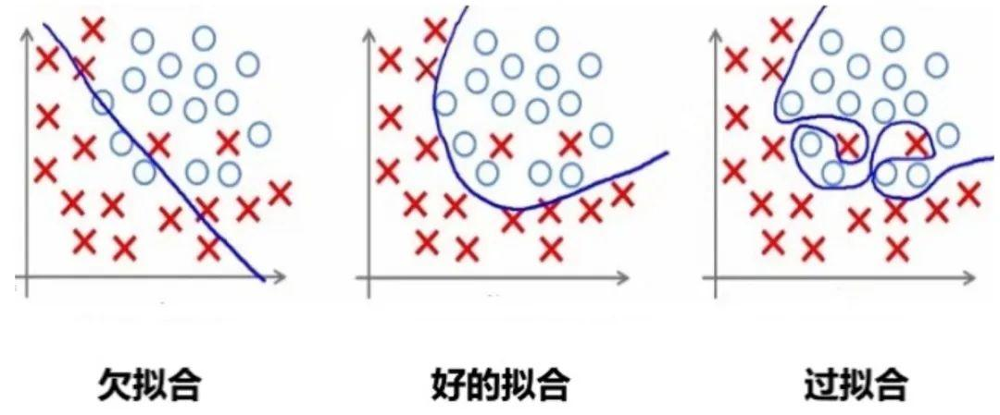

### 1.2 欠拟合

欠拟合是由于模型学习能力不足，无法充分捕捉数据中的复杂关系。

### 1.3 如何判断

那如何判断一个错误的结果是过拟合还是欠拟合呢？

**过拟合**

​		训练误差低，但验证时误差高。模型在训练数据上表现很好，但在验证数据上表现不佳，说明模型可能过度拟合了训练数据中的噪声或特定模式。

**欠拟合**

​		训练误差和测试误差都高。模型在训练数据和测试数据上的表现都不好，说明模型可能太简单，无法捕捉到数据中的复杂模式。

## 2. 解决欠拟合

欠拟合的解决思路比较直接：

1. **增加模型复杂度**：引入更多的参数、增加神经网络的层数或节点数量，使模型能够捕捉到数据中的复杂模式。
2. **增加特征**：通过特征工程添加更多有意义的特征，使模型能够更好地理解数据。
3. **减少正则化强度**：适当减小 L1、L2 正则化强度，允许模型有更多自由度来拟合数据。
4. **训练更长时间**：如果是因为训练不足导致的欠拟合，可以增加训练的轮数或时间.

## 3. 解决过拟合

避免模型参数过大是防止过拟合的关键步骤之一。

模型的复杂度主要由权重w决定，而不是偏置b。偏置只是对模型输出的平移，不会导致模型过度拟合数据。

怎么控制权重w，使w在比较小的范围内？

考虑损失函数，损失函数的目的是使预测值与真实值无限接近，如果在原来的损失函数上添加一个非0的变量
$$
L_1(\hat{y},y) = L(\hat{y},y) + f(w)
$$
其中$f(w)$是关于权重w的函数，$f(w)>0$

要使L1变小，就要使L变小的同时，也要使$f(w)$变小。从而控制权重w在较小的范围内。

### 3.1 L2正则化

L2 正则化通过在损失函数中添加权重参数的平方和来实现，目标是**惩罚**过大的参数值。

#### 3.1.1 数学表示

设损失函数为 $$ L(\theta)$$，其中 $$\theta$$ 表示权重参数，加入L2正则化后的损失函数表示为：
$$
L_{\text{total}}(\theta) = L(\theta) + \lambda \cdot \frac{1}{2} \sum_{i} \theta_i^2
$$
其中：
- $$ L(\theta) $$ 是原始损失函数（比如均方误差、交叉熵等）。
- $$\lambda$$ 是正则化强度，控制正则化的力度。
- $$\theta_i $$ 是模型的第 $$i$$ 个权重参数。
- $$ \frac{1}{2} \sum_{i} \theta_i^2 $$ 是所有权重参数的平方和，称为 L2 正则化项。

L2 正则化会惩罚权重参数过大的情况，通过参数平方值对损失函数进行约束。

为什么是$\frac{\lambda}{2}$？

假设没有1/2，则对L2 正则化项$\theta_i$的梯度为：$2\lambda\theta_i$，会引入一个额外的系数 2，使梯度计算和更新公式变得复杂。

添加1/2后，对$\theta_i$的梯度为：$\lambda\theta_i$。

#### 3.1.2 梯度更新

在 L2 正则化下，梯度更新时，不仅要考虑原始损失函数的梯度，还要考虑正则化项的影响。更新规则为：
$$
\theta_{t+1} = \theta_t - \eta \left( \nabla L(\theta_t) + \lambda \theta_t \right)
$$
其中：

- $$\eta$$ 是学习率。
- $$\nabla L(\theta_t)$$ 是损失函数关于参数$$ \theta_t$$ 的梯度。
- $$ \lambda \theta_t $$ 是 L2 正则化项的梯度，对应的是参数值本身的衰减。

很明显，参数越大惩罚力度就越大，从而让参数逐渐趋向于较小值，避免出现过大的参数。

#### 3.1.3 作用

1. **防止过拟合**：当模型过于复杂、参数较多时，模型会倾向于记住训练数据中的噪声，导致过拟合。L2 正则化通过抑制参数的过大值，使得模型更加平滑，降低模型对训练数据噪声的敏感性。

2. **限制模型复杂度**：L2 正则化项强制权重参数尽量接近 0，避免模型中某些参数过大，从而限制模型的复杂度。通过引入平方和项，L2 正则化鼓励模型的权重均匀分布，避免单个权重的值过大。

3. **提高模型的泛化能力**：正则化项的存在使得模型在测试集上的表现更加稳健，避免在训练集上取得极高精度但在测试集上表现不佳。

4. **平滑权重分布**：L2 正则化不会将权重直接变为 0，而是将权重值缩小。这样模型就更加平滑的拟合数据，同时保留足够的表达能力。

####  3.1.4 代码实现

代码实现如下：

```python
import torch
import torch.nn as nn
import torch.optim as optim
import matplotlib.pyplot as plt

# 设置随机种子以保证可重复性
torch.manual_seed(42)

# 生成随机数据
n_samples = 100
n_features = 20
X = torch.randn(n_samples, n_features)  # 输入数据
y = torch.randn(n_samples, 1)  # 目标值


# 定义一个简单的全连接神经网络
class SimpleNet(nn.Module):
    def __init__(self):
        super(SimpleNet, self).__init__()
        self.fc1 = nn.Linear(n_features, 50)
        self.fc2 = nn.Linear(50, 1)

    def forward(self, x):
        x = torch.relu(self.fc1(x))
        return self.fc2(x)


# 训练函数
def train_model(use_l2=False, weight_decay=0.01, n_epochs=100):
    # 初始化模型
    model = SimpleNet()
    criterion = nn.MSELoss()  # 损失函数（均方误差）

    # 选择优化器
    if use_l2:
        optimizer = optim.SGD(model.parameters(), lr=0.01, weight_decay=weight_decay)  # 使用 L2 正则化
    else:
        optimizer = optim.SGD(model.parameters(), lr=0.01)  # 不使用 L2 正则化

    # 记录训练损失
    train_losses = []

    # 训练过程
    for epoch in range(n_epochs):
        optimizer.zero_grad()  # 清空梯度
        outputs = model(X)  # 前向传播
        loss = criterion(outputs, y)  # 计算损失
        loss.backward()  # 反向传播
        optimizer.step()  # 更新参数

        train_losses.append(loss.item())  # 记录损失

        if (epoch + 1) % 10 == 0:
            print(f'Epoch [{epoch + 1}/{n_epochs}], Loss: {loss.item():.4f}')

    return train_losses


# 训练并比较两种模型
train_losses_no_l2 = train_model(use_l2=False)  # 不使用 L2 正则化
train_losses_with_l2 = train_model(use_l2=True, weight_decay=0.01)  # 使用 L2 正则化

# 绘制训练损失曲线
plt.plot(train_losses_no_l2, label='Without L2 Regularization')
plt.plot(train_losses_with_l2, label='With L2 Regularization')
plt.xlabel('Epoch')
plt.ylabel('Loss')
plt.title('Training Loss: L2 Regularization vs No Regularization')
plt.legend()
plt.show()
```

### 3.2 L1正则化

L1 正则化通过在损失函数中添加权重参数的绝对值之和来约束模型的复杂度。

#### 3.2.1 数学表示

设模型的原始损失函数为 $$ L(\theta)$$，其中 $$\theta$$ 表示模型权重参数，则加入 L1 正则化后的损失函数表示为：
$$
L_{\text{total}}(\theta) = L(\theta) + \lambda \sum_{i} |\theta_i|
$$
其中：
- $$ L(\theta)$$ 是原始损失函数。
- $$ \lambda$$ 是正则化强度，控制正则化的力度。
- $$|\theta_i|$$ 是模型第$$i$$ 个参数的绝对值。
- $$\sum_{i} |\theta_i|$$ 是所有权重参数的绝对值之和，这个项即为 L1 正则化项。

#### 3.2.2 梯度更新

在 L1 正则化下，梯度更新时的公式是：
$$
\theta_{t+1} = \theta_t - \eta \left( \nabla L(\theta_t) + \lambda \cdot \text{sign}(\theta_t) \right)
$$
其中：

- $$ \eta$$ 是学习率。
- $$ \nabla L(\theta_t) $$ 是损失函数关于参数 $$ \theta_t $$ 的梯度。
- $$ \text{sign}(\theta_t) $$ 是参数 $$ \theta_t $$ 的符号函数，表示当 $$\theta_t$$ 为正时取值为 $$1$$，为负时取值为 $$-1$$，等于 0 时为 $$0$$。

因为 L1 正则化依赖于参数的绝对值，其梯度更新时不是简单的线性缩小，而是通过符号函数来直接调整参数的方向。这就是为什么 L1 正则化能促使某些参数完全变为 0。

#### 3.2.3 作用

1. **稀疏性**：L1 正则化的一个显著特性是它会促使许多权重参数变为 **零**。这是因为 L1 正则化倾向于将权重绝对值缩小到零，使得模型只保留对结果最重要的特征，而将其他不相关的特征权重设为零，从而实现 **特征选择** 的功能。

2. **防止过拟合**：通过限制权重的绝对值，L1 正则化减少了模型的复杂度，使其不容易过拟合训练数据。相比于 L2 正则化，L1 正则化更倾向于将某些权重完全移除，而不是减小它们的值。

3. **简化模型**：由于 L1 正则化会将一些权重变为零，因此模型最终会变得更加简单，仅依赖于少数重要特征。这对于高维度数据特别有用，尤其是在特征数量远多于样本数量的情况下。

4. **特征选择**：因为 L1 正则化会将部分权重置零，因此它天然具有特征选择的能力，有助于自动筛选出对模型预测最重要的特征。

#### 3.2.4 与L2对比
- **L1 正则化** 更适合用于产生稀疏模型，会让部分权重完全为零，适合做特征选择。
- **L2 正则化** 更适合平滑模型的参数，避免过大参数，但不会使权重变为零，适合处理高维特征较为密集的场景。

#### 3.2.5 代码实现

代码需要自己实现：

```python
l1_lambda = 0.001
# 计算 L1 正则化项并将其加入到总损失中
l1_norm = sum(p.abs().sum() for p in model.parameters())
loss = loss + l1_lambda * l1_norm
```

### 3.3 Dropout

Dropout 的工作流程如下：

1. 在每次训练迭代中，随机选择一部分神经元（通常以概率 p丢弃，比如 p=0.5）。
2. 被选中的神经元在当前迭代中不参与前向传播和反向传播。
3. 在测试阶段，所有神经元都参与计算，但需要对权重进行缩放（通常乘以 1−p），以保持输出的期望值一致。

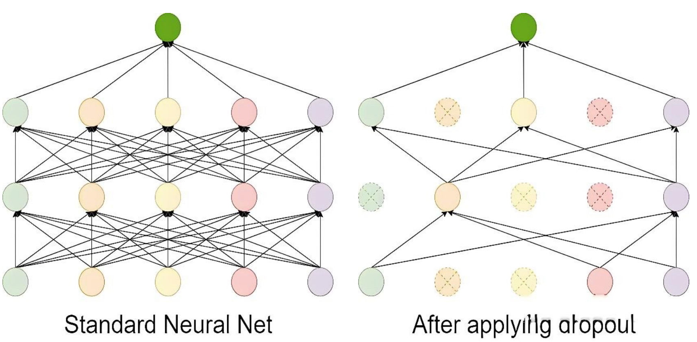

Dropout 是一种在训练过程中随机丢弃部分神经元的技术。它通过减少神经元之间的依赖来防止模型过于复杂，从而避免过拟合。

#### 3.3.1 基本实现

```python
import torch
import torch.nn as nn


def dropout():
    dropout = nn.Dropout(p=0.5)
    x = torch.randint(0, 10, (5, 6), dtype=torch.float)
    print(x)
    # 开始dropout
    print(dropout(x))


if __name__ == "__main__":
    dropout()

```

Dropout过程：

1. 按照指定的概率把部分神经元的值设置为0；
2. 为了规避该操作带来的影响，需对非 0 的元素使用缩放因子$$1/(1-p)$$进行强化。

假设某个神经元的输出为 x，Dropout 的操作可以表示为：

- 在训练阶段：
  $$
  y=\begin{cases}\frac{x}{1−p} & 以概率1−p保留神经元 \\
  0 & 以概率 p 丢弃神经元 \end{cases}
  $$
  
- 在测试阶段：
  $$
  y=x
  $$

为什么要使用缩放因子$$1/(1-p)$$？

在训练阶段，Dropout 会以概率 p随机将某些神经元的输出设置为 0，而以概率 1−p 保留这些神经元。

假设某个神经元的原始输出是 x，那么在训练阶段，它的期望输出值为：
$$
E(y_{train})=(1−p)⋅(\frac{x}{1−p})+p⋅0=x
$$
通过这种缩放，训练阶段的期望输出值仍然是 x，与没有 Dropout 时一致。

#### 3.3.2 权重影响

示例：对图片进行随机丢弃

```python
import torch
from torch import nn
from PIL import Image
from torchvision import transforms
import os

from matplotlib import pyplot as plt

torch.manual_seed(42)


def load_img(path, resize=(224, 224)):
    pil_img = Image.open(path).convert('RGB')
    print("Original image size:", pil_img.size)  # 打印原始尺寸
    transform = transforms.Compose([
        transforms.Resize(resize),
        transforms.ToTensor()  # 转换为Tensor并自动归一化到[0,1]
    ])
    return transform(pil_img)  # 返回[C,H,W]格式的tensor


if __name__ == '__main__':
    dirpath = os.path.dirname(__file__)
    path = os.path.join(dirpath, 'img', '100.jpg')  # 使用os.path.join更安全

    # 加载图像 (已经是[0,1]范围的Tensor)
    trans_img = load_img(path)

    # 添加batch维度 [1, C, H, W]，因为Dropout默认需要4D输入
    trans_img = trans_img.unsqueeze(0)

    # 创建Dropout层
    dropout = nn.Dropout2d(p=0.2)

    drop_img = dropout(trans_img)

    # 移除batch维度并转换为[H,W,C]格式供matplotlib显示
    trans_img = trans_img.squeeze(0).permute(1, 2, 0).numpy()
    drop_img = drop_img.squeeze(0).permute(1, 2, 0).numpy()

    # 确保数据在[0,1]范围内
    drop_img = drop_img.clip(0, 1)

    # 显示图像
    fig = plt.figure(figsize=(10, 5))

    ax1 = fig.add_subplot(1, 2, 1)
    ax1.imshow(trans_img)

    ax2 = fig.add_subplot(1, 2, 2)
    ax2.imshow(drop_img)

    plt.show()
```

效果：

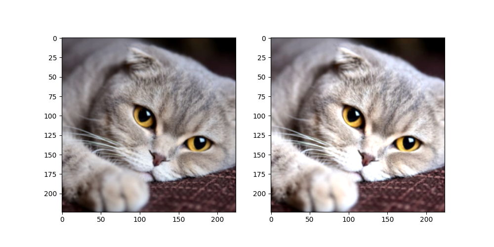

说明：

nn.Dropout2d(p):`Dropout2d` 是针对二维数据设计的 Dropout 层，它在训练过程中随机将输入张量的某些通道（二维平面）置为零。

| 参数     | 要求格式       | 示例形状           | 说明                     |
| :------- | :------------- | :----------------- | :----------------------- |
| **输入** | `(N, C, H, W)` | `(16, 64, 32, 32)` | 批大小×通道×高×宽        |
| **输出** | `(N, C, H, W)` | `(16, 64, 32, 32)` | 与输入同形，部分通道归零 |

### 3.5 数据增强

样本数量不足（即训练数据过少）是导致过拟合（Overfitting）的常见原因之一，可以从以下角度理解：

- 当训练数据过少时，模型容易“记住”有限的样本（包括噪声和无关细节），而非学习通用的规律。
- 简单模型更可能捕捉真实规律，但数据不足时，复杂模型会倾向于拟合训练集中的偶然性模式（噪声）。
- 样本不足时，训练集的分布可能与真实分布偏差较大，导致模型学到错误的规律。
- 小数据集中，个别样本的噪声（如标注错误、异常值）会被放大，模型可能将噪声误认为规律。

数据增强（Data Augmentation）是一种通过人工生成或修改训练数据来增加数据集多样性的技术，常用于解决过拟合问题。数据增强通过“模拟”更多训练数据，迫使模型学习泛化性更强的规律，而非训练集中的偶然性模式。其本质是一种低成本的正则化手段，尤其在数据稀缺时效果显著。

在了解计算机如何处理图像之前，需要先了解图像的构成元素。

图像是由像素点组成的，每个像素点的值范围为: [0, 255], 像素值越大意味着较亮。比如一张 200x200 的图像, 则是由 40000 个像素点组成, 如果每个像素点都是 0 的话, 意味着这是一张全黑的图像。

我们看到的彩色图一般都是多通道的图像, 所谓多通道可以理解为图像由多个不同的图像层叠加而成, 例如我们看到的彩色图像一般都是由 RGB 三个通道组成的，还有一些图像具有 RGBA 四个通道，最后一个通道为透明通道，该值越小，则图像越透明。

数据增强是提高模型泛化能力（鲁棒性）的一种有效方法，尤其在图像分类、目标检测等任务中。数据增强可以模拟更多的训练样本，从而减少过拟合风险。数据增强通过torchvision.transforms模块来实现。

**数据增强的好处**

​		大幅度降低数据采集和标注成本；

​		模型过拟合风险降低，提高模型泛化能力；

官方地址：

transforms：https://pytorch.org/vision/stable/transforms.html

**transforms：**

**常用变换类**

- transforms.Compose：将多个变换操作组合成一个流水线。
- transforms.ToTensor：将 PIL 图像或 NumPy 数组转换为 PyTorch 张量，将图像数据从 uint8 类型 (0-255) 转换为 float32 类型 (0.0-1.0)。
- transforms.Normalize：对张量进行标准化。
- transforms.Resize：调整图像大小。
- transforms.CenterCrop：从图像中心裁剪指定大小的区域。
- transforms.RandomCrop：随机裁剪图像。
- transforms.RandomHorizontalFlip：随机水平翻转图像。
- transforms.RandomVerticalFlip：随机垂直翻转图像。
- transforms.RandomRotation：随机旋转图像。
- transforms.ColorJitter：随机调整图像的亮度、对比度、饱和度和色调。
- transforms.RandomGrayscale：随机将图像转换为灰度图像。
- transforms.RandomResizedCrop：随机裁剪图像并调整大小。

#### 3.5.1 图片缩放

具体参考官方文档：https://pytorch.org/vision/stable/auto_examples/transforms/plot_transforms_illustrations.html

参考代码：

```python
from PIL import Image

def test03():
    img1 = plt.imread('./img/100.jpg')
    plt.imshow(img1)
    plt.show()

    img = Image.open('./img/100.jpg')
    transform = transforms.Compose([transforms.Resize((224, 224)), transforms.ToTensor()])
    r_img = transform(img)
    print(r_img.shape)

    r_img = r_img.permute(1, 2, 0)

    plt.imshow(r_img)
    plt.show()

```

#### 3.5.2 随机裁剪

```python
	img = Image.open('./img/100.jpg')
    transform = transforms.Compose([transforms.RandomCrop(size=(224, 224)), transforms.ToTensor()])
    r_img = transform(img)
    print(r_img.shape)

    r_img = r_img.permute(1, 2, 0)

    plt.imshow(r_img)
    plt.show()
```

#### 3.5.3 随机水平翻转

RandomHorizontalFlip(p)：随机水平翻转图像，参数p表示翻转概率（0 ≤ `p` ≤ 1），`p=1` 表示必定翻转，`p=0` 表示不翻转

```python
	img = Image.open('./img/100.jpg')
    transform = transforms.Compose([transforms.RandomHorizontalFlip(p=1), transforms.ToTensor()])
    r_img = transform(img)
    print(r_img.shape)

    r_img = r_img.permute(1, 2, 0)

    plt.imshow(r_img)
    plt.show()
```

#### 3.5.4 调整图片颜色

```
transforms.ColorJitter(brightness=0, contrast=0, saturation=0, hue=0)
```

brightness：

- 亮度调整的范围。
- 可以`float` 或 `(min, max)` 元组：
  - 如果是 `float`（如 `brightness=0.2`），则亮度在 `[max(0, 1 - 0.2), 1 + 0.2] = [0.8, 1.2]` 范围内随机缩放。
  - 如果是 `(min, max)`（如 `brightness=(0.5, 1.5)`），则亮度在 `[0.5, 1.5]` 范围内随机缩放。

contrast：

- 对比度调整的范围。
- 格式与 brightness 相同。

saturation：

- 饱和度调整的范围。
- 格式与 brightness 相同。

hue：

- 色调调整的范围。
- 可以是一个浮点数（表示相对范围）或一个元组 (min, max)。
- **取值范围必须为 `[-0.5, 0.5]`**（因为色相在 HSV 色彩空间中是循环的，超出范围会导致颜色异常）。
- 例如，hue=0.1 表示色调在 [-0.1, 0.1] 之间随机调整。

```python
	img = Image.open('./img/100.jpg')
    transform = transforms.Compose([transforms.ColorJitter(brightness=0.2, contrast=0.2, saturation=0.2, hue=0.2), transforms.ToTensor()])
    r_img = transform(img)
    print(r_img.shape)

    r_img = r_img.permute(1, 2, 0)

    plt.imshow(r_img)
    plt.show()
```

#### 3.5.5 随机旋转

RandomRotation用于对图像进行随机旋转。

```
transforms.RandomRotation(
    degrees, 
    interpolation=InterpolationMode.NEAREST, 
    expand=False, 
    center=None, 
    fill=0
)
```

degrees：

- 旋转角度的范围，可以是一个浮点数或元组 (min_degree, max_degree)。
- 例如，degrees=30 表示旋转角度在 [-30, 30] 之间随机选择。
- 例如，degrees=(30, 60) 表示旋转角度在 [30, 60] 之间随机选择。

interpolation：

- 插值方法，用于旋转图像。
- 默认是 InterpolationMode.NEAREST（最近邻插值）。
- 其他选项包括 InterpolationMode.BILINEAR（双线性插值）、InterpolationMode.BICUBIC（双三次插值）等。

expand：

- 是否扩展图像大小以适应旋转后的图像。如：当需要保留完整旋转后的图像时（如医学影像、文档扫描）
- 如果为 True，旋转后的图像可能会比原始图像大。
- 如果为 False，旋转后的图像大小与原始图像相同。

center：

- 旋转中心点的坐标，默认为图像中心。
- 可以是一个元组 (x, y)，表示旋转中心的坐标。

fill：

- 旋转后图像边缘的填充值。
- 可以是一个浮点数（用于灰度图像）或一个元组（用于 RGB 图像）。默认填充0(黑色)

```python
	# 加载图像
    image = Image.open('./img/100.jpg')

    # 定义 RandomRotation 变换
    transform = transforms.RandomRotation(degrees=30)  # 旋转角度在 [-30, 30] 之间随机选择

    # 应用变换
    rotated_image = transform(image)

    # 显示图像
    plt.imshow(rotated_image)
    plt.axis('off')
    plt.show()
```

#### 3.5.6 图片转Tensor

```python
import torch
from PIL import Image
from torchvision import transforms
import os


def test001():
    dir_path = os.path.dirname(__file__)

    file_path = os.path.join(dir_path,'img', '1.jpg')

    file_path = os.path.relpath(file_path)
    print(file_path)

    # 1. 读取图片
    img = Image.open(file_path)

    # transforms.ToTensor()用于将 PIL 图像或 NumPy 数组转换为 PyTorch 张量，并自动进行数值归一化和维度调整
    # 将像素值从 [0, 255] 缩放到 [0.0, 1.0]（浮点数）
    # 自动将图像格式从 (H, W, C)（高度、宽度、通道）转换为 PyTorch 标准的 (C, H, W)
    transform = transforms.ToTensor()
    img_tensor = transform(img)
    print(img_tensor)


if __name__ == "__main__":
    test001()

```

#### 3.5.7 Tensor转图片

```python
import torch
from PIL import Image
from torchvision import transforms


def test002():
    # 1. 随机一个数据表示图片
    img_tensor = torch.randn(3, 224, 224)
    # 2. 创建一个transforms
    transform = transforms.ToPILImage()
    # 3. 转换为图片
    img = transform(img_tensor)
    img.show()
    # 4. 保存图片
    img.save("./test.jpg")


if __name__ == "__main__":
    test002()

```

练习：通过一个Demo加深对Torch的API理解和使用

```python
import torch
from PIL import Image
from torchvision import transforms
import os


def test003():
    # 获取文件的相对路径
    dir_path = os.path.dirname(__file__)
    file_path = os.path.relpath(os.path.join(dir_path, 'dog.jpg'))
    # 加载图片
    img = Image.open(file_path)
    # 转换图片为tensor
    transform = transforms.ToTensor()
    t_img = transform(img)

    print(t_img.shape)
    # 获取GPU资源，将图片处理移交给CUDA
    device = 'cuda' if torch.cuda.is_available() else 'cpu'
    t_img = t_img.to(device)
    t_img += 0.3

    # 将图片移交给CPU进行图片保存处理，一般IO操作是基于CPU的
    t_img = t_img.cpu()
    transform = transforms.ToPILImage()
    img = transform(t_img)

    img.show()


if __name__ == "__main__":
    test003()
```

#### 3.5.6 归一化

- 标准化：将图像的像素值从原始范围（如 [0, 255] 或 [0, 1]）转换为均值为 0、标准差为 1 的分布。
- 加速训练：标准化后的数据分布更均匀，有助于加速模型训练。
- 提高模型性能：标准化可以使模型更容易学习到数据的特征，提高模型的收敛性和稳定性。

```python
    img = Image.open('./img/100.jpg')
    transform = transforms.Compose(
        [transforms.ToTensor(),
         transforms.Normalize(mean=[0.485, 0.456, 0.406], std=[0.229, 0.224, 0.225])])
    r_img = transform(img)
    print(r_img.shape)

    r_img = r_img.permute(1, 2, 0)

    plt.imshow(r_img)
    plt.show()
```

mean=[0.485, 0.456, 0.406], std=[0.229, 0.224, 0.225])]

均值（Mean）：数据集中所有图像在每个通道上的像素值的平均值。

标准差（Std）：数据集中所有图像在每个通道上的像素值的标准差。

RGB 三个通道的均值和标准差 **不是随便定义的**，而是需要根据具体的数据集进行统计计算。这些值是 ImageNet 数据集的统计结果，已成为计算机视觉任务的默认标准。

**数据集计算均值和标准差**

以CIFAR10数据集为例：

```python
# 获取数据集
train_data = datasets.CIFAR10(
    root='./cifar10',
    train=True,
    download=True,
    transform=transforms.ToTensor()  # 自动将PIL图像转为[0,1]范围的张量
)


def compute_mean_std(dataset):
    # 初始化累加器
    mean = torch.zeros(3)
    std = torch.zeros(3)
    num_samples = len(dataset)

    # 遍历数据集计算均值
    for img, _ in dataset:
        # dim=(1, 2) 表示对图像的高度（H）和宽度（W）维度求均值，保留通道维度（C）。
        mean += img.mean(dim=(1, 2)) 
    # 全局的通道均值
    mean /= num_samples
    print(mean)

    # 遍历数据集计算标准差
    for img, _ in dataset:
        # 原始mean 是一个形状为 [3] 的张量，表示每个通道的均值。
        # 使用 view(3, 1, 1) 将 mean 的形状从 [3] 改变为 [3, 1, 1]。
        # 这样，mean 的形状变为 [3, 1, 1]，其中 3 表示通道数，1 和 1 分别表示高度和宽度的维度。
        # 当执行 img - mean.view(3, 1, 1) 时，PyTorch 会利用广播机制将 mean 自动扩展到与 img 相同的形状 [3, H, W]。
        # 然后利用方差公式计算：var=E(x-E(x))^2
        std += (img - mean.view(3, 1, 1)).pow(2).mean(dim=(1, 2))
    # 计算出所有图片的方差后，计算平均方差，然后求标准差
    std = torch.sqrt(std / num_samples)

    return mean, std


mean, std = compute_mean_std(train_data)
print(f"Mean: {mean}")  # 输出类似 [0.4914, 0.4822, 0.4465]
print(f"Std: {std}")  # 输出类似 [0.2470, 0.2435, 0.2616]
```

#### 3.5.7 数据增强整合

 使用transforms.Compose()把要增强的操作整合到一起：

```python
from PIL import Image
from pathlib import Path
import matplotlib.pyplot as plt
import numpy as np
import torch
from torchvision import transforms, datasets, utils


def test01():
    # 定义数据增强和归一化
    transform = transforms.Compose(
        [
            transforms.RandomHorizontalFlip(),  # 随机水平翻转
            transforms.RandomRotation(10),  # 随机旋转 ±10 度
            transforms.RandomResizedCrop(
                32, scale=(0.8, 1.0)
            ),  # 随机裁剪到 32x32，缩放比例在0.8到1.0之间
            transforms.ColorJitter(
                brightness=0.2, contrast=0.2, saturation=0.2, hue=0.1
            ),  # 随机调整亮度、对比度、饱和度、色调
            transforms.ToTensor(),  # 转换为 Tensor
            transforms.Normalize((0.5, 0.5, 0.5), (0.5, 0.5, 0.5)),  # 归一化，这是一种常见的经验设置，适用于数据范围 [0, 1]，使其映射到 [-1, 1]
        ]
    )

    # 加载 CIFAR-10 数据集，并应用数据增强
    trainset = datasets.CIFAR10(root="./cifar10_data", train=True, download=True, transform=transform)
    dataloader = DataLoader(trainset, batch_size=4, shuffle=False)

    # 获取一个批次的数据
    images, labels = next(iter(dataloader))

    # 还原图片并显示
    plt.figure(figsize=(10, 5))
    for i in range(4):
        # 反归一化：将像素值从 [-1, 1] 还原到 [0, 1]
        img = images[i] / 2 + 0.5

        # 转换为 PIL 图像
        img_pil = transforms.ToPILImage()(img)

        # 显示图片
        plt.subplot(1, 4, i + 1)
        plt.imshow(img_pil)
        plt.axis('off')
        plt.title(f'Label: {labels[i]}')

    plt.show()


if __name__ == "__main__":
    test01()

```

代码解释：

```
transforms.Normalize(mean=[0.5, 0.5, 0.5], std=[0.5, 0.5, 0.5])
```

若数据分布与ImageNet差异较大（如医学影像、卫星图、MNIST等），或均值和标准差未知时，可用此简化设置。

将图片进行归一化，使数据更符合正态分布，归一化公式：
$$
normalized\_img=\frac{img−0.5}{0.5} =2×img−1
$$

```
img = img / 2 + 0.5
```

表示反归一化，是归一化的逆运算：
$$
img=\frac{normalized\_img+1}{2} =\frac{normalized\_img}{2}+0.5
$$

# 九、批量标准化

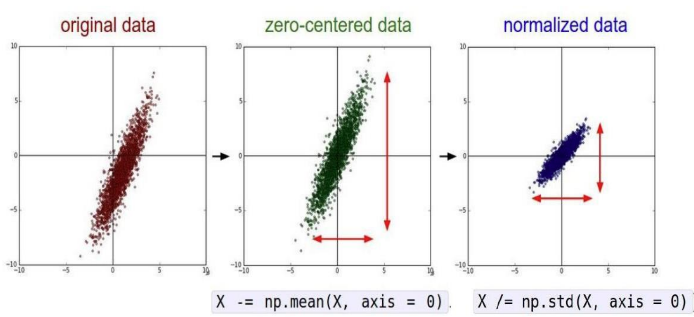

批量标准化（Batch Normalization, BN）是一种广泛使用的神经网络正则化技术，核心思想是对每一层的输入进行标准化，然后进行缩放和平移，旨在加速训练、提高模型的稳定性和泛化能力。批量标准化通常在**全连接层**或**卷积层**之后、激活函数之前应用。

**核心思想**

Batch Normalization（BN）通过对每一批（batch）数据的每个特征通道进行标准化，解决**内部协变量偏移**（Internal Covariate Shift）问题，从而：

- 加速网络训练
- 允许使用更大的学习率
- 减少对初始化的依赖
- 提供轻微的正则化效果

批量标准化的基本思路是在每一层的输入上执行标准化操作，并学习两个可训练的参数：缩放因子 $$\gamma$$ 和偏移量 $$\beta$$。

在深度学习中，批量标准化（Batch Normalization）在**训练阶段**和**测试阶段**的行为是不同的。在测试阶段，由于没有 mini-batch 数据，无法直接计算当前 batch 的均值和方差，因此需要使用训练阶段计算的**全局统计量**（均值和方差）来进行标准化。

官网地址：https://pytorch.org/docs/stable/nn.html#normalization-layers

## 1. 训练阶段的批量标准化

### 1.1 计算均值和方差
对于给定的神经网络层，假设输入数据为 $$\mathbf{x} = \{x_1, x_2, \ldots, x_m\}$$，其中 $$m是$$批次大小。我们首先计算该批次数据的均值和方差。

- 均值（Mean）
  $$
  \mu_B = \frac{1}{m} \sum_{i=1}^m x_i
  $$
  
- 方差
  $$
  \sigma_B^2 = \frac{1}{m} \sum_{i=1}^m (x_i - \mu_B)^2
  $$
  

### 1.2 标准化
使用计算得到的均值和方差对数据进行标准化，使得每个特征的均值为0，方差为1。

- **标准化后的值**
  $$
  \hat{x}_i = \frac{x_i - \mu_B}{\sqrt{\sigma_B^2 + \epsilon}}
  $$
  其中，$$\epsilon$$ 是一个很小的常数，防止除以零的情况。

### 1.3 缩放和平移
标准化后的数据通常会通过可训练的参数进行缩放和平移，以恢复模型的表达能力。

- **缩放（Gamma）**：
  $$
  y_i = \gamma \hat{x}_i
  $$
  
- **平移（Beta）**：
  $$
  y_i = \gamma \hat{x}_i + \beta
  $$
  其中，$$\gamma$$ 和 $$\beta$$ 是在训练过程中学习到的参数。它们会随着网络的训练过程通过反向传播进行更新。

### 1.4 更新全局统计量

通过指数移动平均（Exponential Moving Average, EMA）更新全局均值和方差：
$$
μ_{global}=(1−momentum)⋅μ_{global}+momentum⋅μ_B\\

σ_{global}^2=(1−momentum)⋅σ_{global}^2+momentum⋅σ_B^2
$$
其中，momentum 是一个超参数，控制当前 mini-batch 统计量对全局统计量的贡献。

momentum 是一个介于 0 和 1 之间的值，控制当前 mini-batch 统计量的权重。PyTorch 中 momentum 的默认值是 0.1。

**与优化器中的 momentum 的区别**

- 批量标准化中的 momentum：
  - 用于更新全局统计量（均值和方差）。
  - 控制当前 mini-batch 统计量对全局统计量的贡献。
- 优化器中的 momentum：
  - 用于加速梯度下降过程，帮助跳出局部最优。
  - 例如，SGD 优化器中的 momentum 参数。

两者虽然名字相同，但作用完全不同，不要混淆。

## 2. 测试阶段的批量标准化

在测试阶段，由于没有 mini-batch 数据，无法直接计算当前 batch 的均值和方差。因此，使用训练阶段通过 EMA 计算的全局统计量（均值和方差）来进行标准化。

在测试阶段，使用全局统计量对输入数据进行标准化：
$$
\hat x_i=\frac{x_i−μ_{global}}{\sqrt{σ_{global}^2+ϵ}}
$$
然后对标准化后的数据进行缩放和平移：
$$
yi=γ⋅\hat{x}_i+β
$$
**为什么使用全局统计量？**

**一致性**：

- 在测试阶段，输入数据通常是单个样本或少量样本，无法准确计算均值和方差。
- 使用全局统计量可以确保测试阶段的行为与训练阶段一致。

**稳定性**：

- 全局统计量是通过训练阶段的大量 mini-batch 数据计算得到的，能够更好地反映数据的整体分布。
- 使用全局统计量可以减少测试阶段的随机性，使模型的输出更加稳定。

**效率**：

- 在测试阶段，使用预先计算的全局统计量可以避免重复计算，提高效率。

## 3. 作用

批量标准化（Batch Normalization, BN）通过以下几个方面来提高神经网络的训练稳定性、加速训练过程并减少过拟合：

### 3.1 缓解梯度问题

标准化处理可以防止激活值过大或过小，避免了激活函数（如 Sigmoid 或 Tanh）饱和的问题，从而缓解梯度消失或爆炸的问题。

### 3.2 加速训练

由于 BN 使得每层的输入数据分布更为稳定，因此模型可以使用更高的学习率进行训练。这可以加快收敛速度，并减少训练所需的时间。

### 3.3 减少过拟合

- **类似于正则化**：虽然 BN 不是一种传统的正则化方法，但它通过对每个批次的数据进行标准化，可以起到一定的正则化作用。它通过在训练过程中引入了噪声（由于批量均值和方差的估计不完全准确），这有助于提高模型的泛化能力。

- **避免对单一数据点的过度拟合**：BN 强制模型在每个批次上进行标准化处理，减少了模型对单个训练样本的依赖。这有助于模型更好地学习到数据的整体特征，而不是对特定样本的噪声进行过度拟合。

## 4.函数说明

`torch.nn.BatchNorm1d` 是 PyTorch 中用于一维数据的批量标准化（Batch Normalization）模块。

```python
torch.nn.BatchNorm1d(
    num_features,         # 输入数据的特征维度
    eps=1e-05,           # 用于数值稳定性的小常数
    momentum=0.1,        # 用于计算全局统计量的动量
    affine=True,         # 是否启用可学习的缩放和平移参数
    track_running_stats=True,  # 是否跟踪全局统计量
    device=None,         # 设备类型（如 CPU 或 GPU）
    dtype=None           # 数据类型
)
```

参数说明：

eps：用于数值稳定性的小常数，添加到方差的分母中，防止除零错误。默认值：1e-05

momentum：用于计算全局统计量（均值和方差）的动量。默认值：0.1，参考本节1.4

affine：是否启用可学习的缩放和平移参数（γ和 β）。如果 affine=True，则模块会学习两个参数；如果 affine=False，则不学习参数，直接输出标准化后的值 $\hat x_i$。默认值：True

track_running_stats：是否跟踪全局统计量（均值和方差）。如果 track_running_stats=True，则在训练过程中计算并更新全局统计量，并在测试阶段使用这些统计量。如果 track_running_stats=False，则不跟踪全局统计量，每次标准化都使用当前 mini-batch 的统计量。默认值：True

## 4. 代码实现

```python
import torch
from torch import nn
from matplotlib import pyplot as plt

from sklearn.datasets import make_circles
from sklearn.model_selection import train_test_split
from torch.nn import functional as F
from torch import optim

# 数据准备
# 生成非线性可分数据（同心圆）
# n_samples	int	总样本数（默认100），内外圆各占一半
# noise	float	添加到数据中的高斯噪声标准差（默认0.0）
# factor	float	内圆与外圆的半径比（默认0.8）
# random_state	int	随机数种子，保证可重复性

# 输出数据
# X: 二维坐标数组，形状 (n_samples, 2)
# 每行是一个数据点的 [x, y] 坐标
# y: 类别标签 0（外圆）或 1（内圆），形状 (n_samples,)
x, y = make_circles(n_samples=2000, noise=0.1, factor=0.4, random_state=42)
x = torch.tensor(x, dtype=torch.float)
y = torch.tensor(y, dtype=torch.long)

x_train, x_test, y_train, y_test = train_test_split(x, y, test_size=0.3, random_state=42)

# 可视化原始训练数据和测试数据
plt.scatter(x[:, 0], x[:, 1], c=y, cmap='coolwarm', edgecolors='k')
plt.show()


# 定义BN模型
class NetWithBN(nn.Module):
    def __init__(self):
        super().__init__()
        self.fc1 = nn.Linear(2, 64)
        self.bn1 = nn.BatchNorm1d(64)
        self.fc2 = nn.Linear(64, 32)
        self.bn2 = nn.BatchNorm1d(32)
        self.fc3 = nn.Linear(32, 2)

    def forward(self, x):
        x = F.relu(self.bn1(self.fc1(x)))
        x = F.relu(self.bn2(self.fc2(x)))
        x = self.fc3(x)
        return x


# 定义无BN模型
class NetWithoutBN(nn.Module):
    def __init__(self):
        super().__init__()
        self.fc1 = nn.Linear(2, 64)
        self.fc2 = nn.Linear(64, 32)
        self.fc3 = nn.Linear(32, 2)

    def forward(self, x):
        x = F.relu(self.fc1(x))
        x = F.relu(self.fc2(x))
        x = self.fc3(x)
        return x


# 定义训练函数
def train(model, x_train, y_train, x_test, y_test, name, lr=0.1, epochs=500):
    criterion = nn.CrossEntropyLoss()
    optimizer = optim.SGD(model.parameters(), lr=lr)

    train_loss = []
    test_acc = []

    for epoch in range(epochs):
        model.train()
        y_pred = model(x_train)
        loss = criterion(y_pred, y_train)
        optimizer.zero_grad()
        loss.backward()
        optimizer.step()
        train_loss.append(loss.item())

        model.eval()
        with torch.no_grad():
            y_test_pred = model(x_test)
            _, pred = torch.max(y_test_pred, dim=1)
            correct = (pred == y_test).sum().item()
            test_acc.append(correct / len(y_test))

        if epoch % 100 == 0:
            print(f'{name}|Epoch:{epoch},loss:{loss.item():.4f},acc:{test_acc[-1]:.4f}')
    return train_loss, test_acc


model_bn = NetWithBN()
model_nobn = NetWithoutBN()

bn_train_loss, bn_test_acc = train(model_bn, x_train, y_train, x_test, y_test, name='BN')
nobn_train_loss, nobn_test_acc = train(model_nobn, x_train, y_train, x_test, y_test, name='NoBN')


def plot(bn_train_loss, nobn_train_loss, bn_test_acc, nobn_test_acc):
    fig = plt.figure(figsize=(12, 5))
    ax1 = fig.add_subplot(1, 2, 1)
    ax1.plot(bn_train_loss, 'b', label='BN')
    ax1.plot(nobn_train_loss, 'r', label='NoBN')
    ax1.legend()

    ax2 = fig.add_subplot(1, 2, 2)
    ax2.plot(bn_test_acc, 'b', label='BN')
    ax2.plot(nobn_test_acc, 'r', label='NoBN')
    ax2.legend()
    plt.show()


plot(bn_train_loss, nobn_train_loss, bn_test_acc, nobn_test_acc)

```

# 十、模型的保存和加载

训练一个模型通常需要大量的数据、时间和计算资源。通过保存训练好的模型，可以满足后续的模型部署、模型更新、迁移学习、训练恢复等各种业务需要求。

## 1. 标准网络模型构建

```python
class MyModle(nn.Module):
    def __init__(self, input_size, output_size):
        super(MyModle, self).__init__()
        # 创建一个全连接网络(full connected layer)
        self.fc1 = nn.Linear(input_size, 128)
        self.fc2 = nn.Linear(128, 64)
        self.fc3 = nn.Linear(64, output_size)

    def forward(self, x):
        x = self.fc1(x)
        x = self.fc2(x)
        output = self.fc3(x)
        return output
    
# 创建模型实例
model = MyModel(input_size=10, output_size=2)
# 输入数据
x = torch.randn(5, 10)
# 调用模型
output = model(x)
```

forward 方法是 PyTorch 中 nn.Module 类的**必须实现的方法**。它是定义神经网络前向传播逻辑的地方，决定了数据如何通过网络层传递并生成输出。同时forward 方法定义了计算图，PyTorch 会根据这个计算图自动计算梯度并更新参数。

## 2. 序列化模型对象

模型序列化对象的保存和加载：

**模型保存**：

```python
torch.save(obj, f, pickle_module=pickle, pickle_protocol=DEFAULT_PROTOCOL, _use_new_zipfile_serialization=True)
```

参数说明：

- obj：要保存的对象，可以是模型、张量、字典等。
- f：保存文件的路径或文件对象。可以是字符串（文件路径）或文件描述符。
- pickle_module：用于序列化的模块，默认是 Python 的 pickle 模块。
- pickle_protocol：pickle 模块的协议版本，默认是 DEFAULT_PROTOCOL（通常是最高版本）。

**模型加载**：

```
torch.load(f, map_location=None, pickle_module=pickle, **pickle_load_args)
```

参数说明：

- f：文件路径或文件对象。可以是字符串（文件路径）或文件描述符。
- map_location：指定加载对象的设备位置（如 CPU 或 GPU）。默认是 None，表示保持原始设备位置。例如：map_location=torch.device('cpu') 将对象加载到 CPU。
- pickle_module：用于反序列化的模块，默认是 Python 的 pickle 模块。
- pickle_load_args：传递给 pickle_module.load() 的额外参数。

```python
import torch
import torch.nn as nn
import pickle


class MyModle(nn.Module):
    def __init__(self, input_size, output_size):
        super(MyModle, self).__init__()
        self.fc1 = nn.Linear(input_size, 128)
        self.fc2 = nn.Linear(128, 64)
        self.fc3 = nn.Linear(64, output_size)

    def forward(self, x):
        x = self.fc1(x)
        x = self.fc2(x)
        output = self.fc3(x)
        return output


def test001():
    model = MyModle(input_size=128, output_size=32)
    # 序列化方式保存模型对象
    torch.save(model, "model.pkl", pickle_module=pickle, pickle_protocol=2)


def test002():
    # 注意设备问题
    model = torch.load("model.pkl", map_location="cpu", pickle_module=pickle)
    print(model)


if __name__ == "__main__":
    test001()
    test002()

```

打印结果：

```python
MyModle(
  (fc1): Linear(in_features=128, out_features=128, bias=True)
  (fc2): Linear(in_features=128, out_features=64, bias=True)
  (fc3): Linear(in_features=64, out_features=32, bias=True)
)
```

.pkl 文件是二进制文件，内容是通过 pickle 模块序列化的 Python 对象。它可以保存几乎任何 Python 对象，但可能存在兼容性问题（如 Python 2 和 Python 3 之间的差异）。

.pth 文件是二进制文件，内容通常是序列化的 PyTorch 模型或张量。使用 .pth 作为扩展名是为了明确表示这是一个 PyTorch 模型文件。

## 3. 保存模型参数

这种形式更常用，只需要保存权重、偏置、准确率等相关参数，都可以在加载后打印观察！

```python
import torch
import torch.nn as nn
import torch.optim as optim
import pickle


class MyModle(nn.Module):
    def __init__(self, input_size, output_size):
        super(MyModle, self).__init__()
        self.fc1 = nn.Linear(input_size, 128)
        self.fc2 = nn.Linear(128, 64)
        self.fc3 = nn.Linear(64, output_size)

    def forward(self, x):
        x = self.fc1(x)
        x = self.fc2(x)
        output = self.fc3(x)
        return output


def test003():
    model = MyModle(input_size=128, output_size=32)
    optimizer = optim.SGD(model.parameters(), lr=0.01)
    # 构建要存储的模型参数
    save_dict = {
        "init_params": {
            "input_size": 128,  # 输入特征数
            "output_size": 32,  # 输出特征数
        },
        "accuracy": 0.99,  # 模型准确率
        "model_state_dict": model.state_dict(),
        "optimizer_state_dict": optimizer.state_dict(),
    }
    torch.save(save_dict, "model_dict.pth")


def test004():
    save_dict = torch.load("model_dict.pth")
    model = MyModle(
        input_size=save_dict["init_params"]["input_size"],
        output_size=save_dict["init_params"]["output_size"],
    )
    # 初始化模型参数
    model.load_state_dict(save_dict["model_state_dict"])
    optimizer = optim.SGD(model.parameters(), lr=0.01)
    # 初始化优化器参数
    optimizer.load_state_dict(save_dict["optimizer_state_dict"])
    # 打印模型信息
    print(save_dict["accuracy"])
    print(model)


if __name__ == "__main__":
    test003()
    test004()

```

**推理时加载模型参数简单如下**：

```python
# 保存模型状态字典
torch.save(model.state_dict(), 'model.pth')

# 加载模型状态字典
model = MyModel(128, 32)
model.load_state_dict(torch.load('model.pth'))

```

# 十一、项目实战

1.使用全连接网络训练和验证MNIST数据集

代码：

```python
import torch
from torch import nn
from torchvision import datasets, transforms
from torch.utils.data import DataLoader
from torch import optim
from PIL import Image
import os

# 数据预处理
transform = transforms.Compose([transforms.ToTensor()])

# 数据准备
train_dataset = datasets.MNIST(root='./data', train=True, transform=transform, download=True)
eval_dataset = datasets.MNIST(root='./data', train=False, transform=transform, download=True)

train_loader = DataLoader(dataset=train_dataset, batch_size=64, shuffle=True)
eval_loader = DataLoader(dataset=eval_dataset, batch_size=512, shuffle=True)


# 定义网络结构
class MyNet(nn.Module):
    def __init__(self):
        super(MyNet, self).__init__()
        self.fc1 = nn.Linear(784, 256)
        self.bn1 = nn.BatchNorm1d(256)
        self.relu = nn.ReLU()
        self.fc2 = nn.Linear(256, 128)
        self.bn2 = nn.BatchNorm1d(128)
        self.fc3 = nn.Linear(128, 10)

    def forward(self, x):
        x = x.view(-1, 28 * 28)
        x = self.bn1(self.fc1(x))
        x = self.relu(x)
        x = self.bn2(self.fc2(x))
        x = self.relu(x)
        x = self.fc3(x)
        return x


model = MyNet()
# 定义损失函数
criterion = nn.CrossEntropyLoss()
# 定义优化器
optimizer = optim.Adam(model.parameters(), lr=0.001)

# 训练
def train(model, train_loader, epochs):
    model.train()

    for epoch in range(epochs):
        correct = 0
        for data, target in train_loader:
            output = model(data)
            loss = criterion(output, target)
            optimizer.zero_grad()
            loss.backward()
            optimizer.step()

            _, predicted = torch.max(output.data, 1)

            correct += (predicted.eq(target)).sum().item()
        correct /= len(train_loader.dataset)

        print(f'Train Epoch:  {epoch} , loss: {loss.item():.4f},acc:{correct:.4f}')

# 验证
def eval(model, eval_loader):
    model.eval()
    eval_loss = 0
    correct = 0

    with torch.no_grad():
        for data, target in eval_loader:
            output = model(data)
            eval_loss += criterion(output, target).item()

            _, predicted = torch.max(output.data, 1)

            correct += (predicted.eq(target)).sum().item()

        eval_loss /= len(eval_loader.dataset)
        acc = 100.0 * correct / len(eval_loader.dataset)
        print(f'loss: {eval_loss:.4f}, acc: {acc:.4f}')

# 保存模型
def save_model():
    torch.save(model.state_dict(), 'mnist_fc_model.pt')

# 预测
def predict(img_path):
    model = MyNet()
    model.load_state_dict(torch.load('mnist_fc_model.pt'))
    model.eval()

    img = Image.open(img_path).convert('L')
    transform = transforms.Compose([
        transforms.Resize((28, 28)),
        transforms.ToTensor()
    ])
    t_img = transform(img).unsqueeze(0)
    print(t_img.shape)

    with torch.no_grad():
        output = model(t_img)
        _, predicted = torch.max(output.data, 1)

        print(predicted.item())


epochs = 5

train(model, train_loader, epochs)
eval(model, eval_loader)

save_model()

img_path = './img/7.png'
predict(img_path)

```

2.练习：使用全连接网络训练和验证CIFAR10数据集

并思考：为什么CIFAR10数据集的准确率很低？
